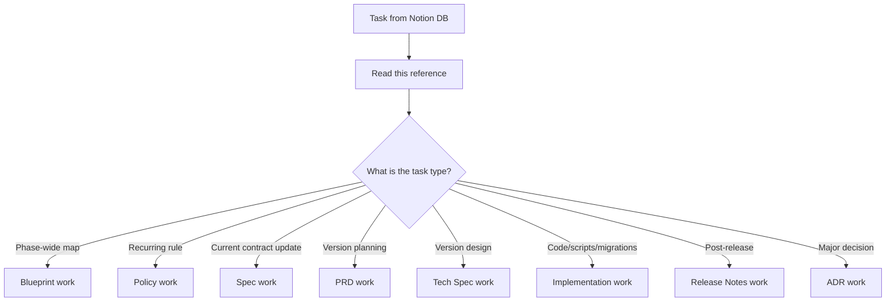
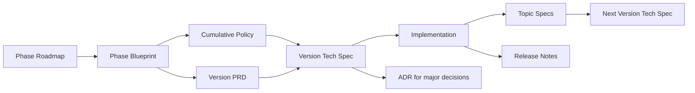

# Documentation Workflow Reference

Source SSOT: [제품 문서화 가이드 — 문서 체계와 작성 스킬](https://www.notion.so/ada346dac45682dca9f001cfff8ae0fc)

Use this reference when the Notion task database row could be **PRD**, **설계 (Tech Spec)**, **스펙**, or **구현** work. Read it before classifying the next work unit.

## Core Principle

Documents have different lifetimes and purposes:

| Document | Lifetime | Role |
|---|---|---|
| **Blueprint** | Phase duration | Phase-wide route map, domain model, milestone plan — not an implementation contract |
| **Policy** | Cumulative | Rules that persist across versions (migration policy, naming, OAuth, error codes) |
| **Spec** | Living / topic-based | Current implementation contract (DB schema, MCP tools, API routes, Notion Worker contracts) |
| **PRD** | Frozen at release | Why and what for this version — user value and scope |
| **Tech Spec** | Frozen at release | What to implement this version — data model, API, algorithms, verification |
| **Release Notes** | Cumulative | What actually shipped vs plan |
| **ADR** | Immutable | One major decision record |

**Naming:** Use **Tech Spec** in document titles and the [문서 타입 카탈로그](https://www.notion.so/dd9b44cc438e45fc8593315cd57eec47). Notion `태그` = `설계`. Legacy internal alias **D3** — workflow shorthand only; do not use in titles.

**SSOT rule:** When information overlaps, the longest-lived document wins — product overview for principles, Blueprint for phase map, Policy for recurring rules, topic Spec for current implementation contracts. **Notion is authoritative**; repo `docs/` mirrors are operational shortcuts only.

## Decision Flow

### Quick classification cues

| Task signal | Work type | Do not confuse with |
|---|---|---|
| "기획안", "PRD", user value / scope for one version | **PRD** | Tech Spec (implementation detail), Spec (current contract) |
| "설계문서", "Tech Spec", schema/API for one version | **Tech Spec** | Blueprint (phase-wide), Spec (already shipped contract) |
| "스펙", "Spec", "현재 구현 계약", "스키마 최신화" | **Topic Spec** | Tech Spec (version intent), PRD (user value) |
| "개발", "구현", "implementation", app/package/MCP work | **Implementation** | PRD/Tech Spec drafting, Spec documentation |
| "Blueprint", "Phase roadmap", milestone cut plan | **Blueprint** | Version Tech Spec |
| "정책", "Policy", repeated rule across versions | **Policy** | ADR (one-time decision) |

## Dependency Order

### Preconditions by work type

| Work type | Can start when |
|---|---|
| **Blueprint** | Phase roadmap or product overview exists |
| **Policy** | Recurring rule identified (often from Blueprint or repeated Tech Spec content) |
| **PRD** | Phase roadmap/Blueprint exists or user explicitly requests drafting roadmap first |
| **Tech Spec** | Version PRD complete or accepted; relevant Policy/Blueprint read |
| **Implementation** | Roadmap, PRD, and Tech Spec complete or explicitly accepted |
| **Topic Spec** | Relevant code/migrations/MCP tools/tests exist or changed; separate from version planning |
| **Release Notes** | Version implementation shipped |
| **ADR** | Major decision made during PRD/Tech Spec/implementation |

## What To Do For Each Work Type

### PRD (기획)

**Goal:** Define why and what for this version.

**Read first:** Phase roadmap/Blueprint, product overview, prior version PRD/Release Notes if relevant.

**Produce:** Store in **유PD 개발 문서** via `youpd-dev-docs` skill.

**Produce content:**
- User scenarios, triggers, natural-language reporting expectations
- In-scope / out-of-scope for this version
- Open questions deferred to Tech Spec

**Do not include:** DB field details, API contracts, migration SQL — send those to Tech Spec.

**Naming:** `{제품명} v0.X 기획안` (e.g. `YouPD v0.13 MCP Workflow PRD`)

### Tech Spec (설계)

**Goal:** Define what will actually be implemented this version.

**Read first:** Version PRD, Phase Blueprint, applicable Policy docs.

**Produce:**
- Data model, interfaces, algorithms, operational rules for this version only
- Verification plan (tests, smoke checks)
- Items pulled from Blueprint that belong in this version cut

**Do not include:** Phase-wide tables/APIs not in this version — keep in Blueprint. Recurring rules — extract to Policy.

**Naming:** `{제품명} v0.X 설계문서 — {주제}`

### Topic Spec (스펙)

**Goal:** Document what the **current code** actually guarantees — a living contract, not version-scoped intent.

**Read first:** Current code on `main`, Drizzle migrations, MCP tool definitions, tests, related Policy/Blueprint/Tech Spec.

**Produce:**
- **Current Contract** — tables, indexes, MCP tools, API routes, error codes, env vars as implemented
- **Not Implemented / Planned** — Blueprint/Tech Spec items not yet in code
- **Validation** — which tests/smoke checks enforce the contract
- **Change Log** — contract change history

**Spec units:** DB schema, MCP tool surface, REST/API contract, Notion Worker tools, error codes, env vars.

**Naming:** `YouPD 스펙 — {계약 영역}`

### Implementation (구현)

**Goal:** Ship code matching the accepted Tech Spec.

**Read first:** Version PRD, Tech Spec, `AGENTS.md`, `docs/testing.md`, current code on `main`.

**Produce:** Changes in `apps/*`, `packages/*`, migrations, tests — per `AGENTS.md`.

**After implementation:** Update topic Specs in Notion; draft Release Notes.

### Blueprint / Policy / Release Notes / ADR

| Type | When | Key output |
|---|---|---|
| **Blueprint** | Phase or large initiative start | Route map, domain model, version cut plan, open questions |
| **Policy** | Recurring rule emerges | Rules, exceptions, examples, related doc links |
| **Release Notes** | After version ships | Shipped features, plan vs actual, known issues |
| **ADR** | Major decision moment | Decision, alternatives, rationale — immutable; supersede with new ADR |

## Notion Task Database Mapping

Development task database (YouPD + youpd-skills):
`https://www.notion.so/paxhumana/55eda245160f43eba0ebe28b71604f89?v=c58d8705594d4e7c8844ab7d98354513`

When inspecting the development task database, map task labels/links to work types:

| Notion task kind | Follow section |
|---|---|
| Roadmap / Blueprint task | Blueprint |
| PRD / 기획 task | PRD |
| Design / 설계 task | Tech Spec |
| Spec / 스펙 task | Topic Spec |
| Development / 구현 task | Implementation |
| Release / 릴리즈 task | Release Notes |

If the task type is ambiguous, read linked documents and use the classification cues above before proceeding.

## Notion Document Stores

| Role | Link / ID |
|---|---|
| Development task database | [개발 태스크 DB](https://www.notion.so/paxhumana/55eda245160f43eba0ebe28b71604f89) |
| Long-form dev docs (PRD, 설계, ADR) | [유PD 개발 문서](https://www.notion.so/5ac346dac45682cf98ed815c25b32d38) |
| Document type catalog | [문서 타입 카탈로그](https://www.notion.so/dd9b44cc438e45fc8593315cd57eec47) |
| Doc data source | `collection://b2a346da-c456-8251-a5c9-876afa9c62ef` |
| Documentation operating system | [문서화 운영체계](https://www.notion.so/paxhumana/368346dac45680789ff6c9859bfa2191) |
| Product/project planning | [YouPD planning views](https://www.notion.so/TV-35e2f1b57fc380e59f84e5ed02c788d1) |

## Anti-Patterns

- Putting the entire phase DB schema in one version Tech Spec → keep in Blueprint, cut per version in Tech Spec
- Copying recurring rules into every version Tech Spec → extract to Policy
- Creating version-scoped Spec docs → Spec is topic-based and living
- Marking unimplemented Blueprint items as current Spec contracts → use Not Implemented / Planned
- Appending implementation results to PRD → use Release Notes or topic Spec
- Editing a shipped Tech Spec retroactively → new version Tech Spec or ADR
- Treating ADR as updatable policy → ADR is immutable; Policy is the living rule set
- Using **D3** in document titles or catalog rows → use **Tech Spec**
- Planning from repo `docs/` without checking Notion → Notion wins when they diverge

## YouPD Examples

| Document | Example |
|---|---|
| Product PRD (local mirror) | `docs/유피디 — 유튜브 기획 제작 커스텀 에이전트 기획안 c29d45781454451ea58ed4677b23e946.md` |
| Architecture / Blueprint (local mirror) | `docs/뷰트랩 자체 구축 설계 — Notion DB + YouTube API + MCP c478864759b447d7aa2c2065f5547232.md` |
| ADR (repo) | `docs/adr/` |
| MCP version manifest | `packages/api/src/mcp/version/manifest.ts` |
| Drizzle schema SSOT | `packages/db/` |
| Notion Worker schema SSOT | `apps/notion-worker/src/lib/schema.ts` |

Canonical long-form history lives in **유PD 개발 문서** and linked Notion pages. Treat repo mirrors as secondary.
