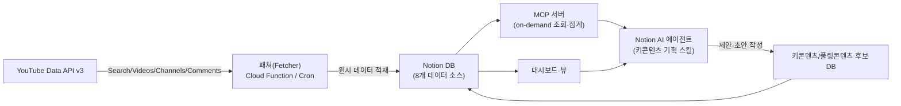
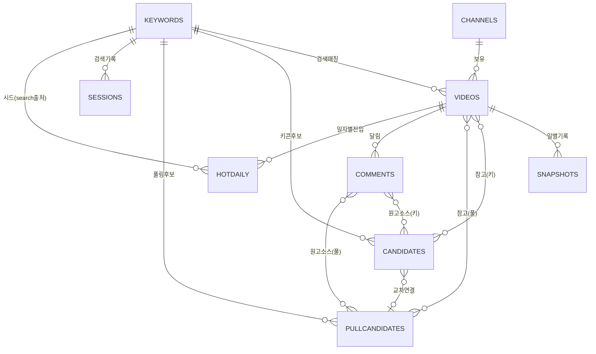
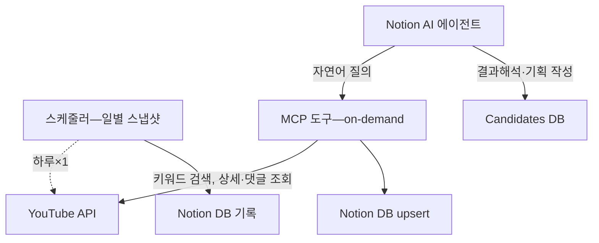

# 뷰트랩 자체 구축 설계 — Notion DB + YouTube API + MCP

<aside>
📊

**목표**: 뷰트랩 월구독료를 **0원**으로 대체하고, 우리만의 Notion DB + YouTube Data API + MCP + Notion AI 에이전트로 **키콘텐츠 기획 4단계**를 자동화한다.

**기반 문서**: [뷰트랩 서비스 설명](https://www.notion.so/35e2f1b57fc38091ace0ea9a0843c194?pvs=21) · [키콘텐츠 기획](https://www.notion.so/4cb2f1b57fc382d6bc62019efc1cfd7b?pvs=21)

</aside>

## 1. 전체 그림

<aside>
💡

뷰트랩이 제공하는 *영상 찾기 / 채널 찾기 / 채널 분석 / 주요 지표(기여도·성과도·노출확률)*를 우리가 *Notion DB + 계산식 필드 + 대시보드 뷰*로 재현합니다. 일별 조회수 변화는 *자체 스냅샷 DB*로 누적합니다 (운영 1개월 뒤 노출확률 산출 가능).

</aside>

## 2. 데이터베이스 설계

### 2-1. DB 구성 9개

| # | DB 명 | 역할 | 주요 관계 |
| --- | --- | --- | --- |
| 1 | **Keywords** 키워드 | 추적 중인 키워드, 우선순위, 명사 유형, 마지막 수집일 | → Videos, KeyContentCandidates |
| 2 | **Channels** 채널 | 채널 메타(구독자, 누적조회수, 개설일, 평균 조회수 등) | → Videos |
| 3 | **Videos** 영상 | 개별 영상 메타(제목, 썸네일, 게시일, 최신 조회수 등) | → Channel, Keyword, Snapshots |
| 4 | **Video Snapshots** 일별 스냅샷 | 영상의 일별 조회수·좋아요·댓글 시계열 | → Video |
| 5 | **Comments** 댓글 | **영상당 좋아요 TOP 50 댓글**만 수집 — 원고 작성 에이전트의 1차 소스 | → Videos, Key/Pull Candidates |
| 6 | **Key Content Candidates** 키콘텐츠 후보 | 4단계 기획의 작업 공간 (함정 체크, 명사 판단, 판매논리) | → Keyword, Reference Videos |
| 7 | **Pull Content Candidates** 풀링콘텐츠 후보 | 풀링콘텐츠 작업 공간 (주제·썸네일·댓글 인사이트·대본 초안) | → Keyword, Reference Videos, Key Candidates |
| 8 | **Search Sessions** 검색 세션 | API 호출 기록 (날짜, 키워드, 반환 수, 소모 할당량) | → Keyword |
| 9 | **Hot Video Daily** 일자별 핫비디오 | YouTube 인기 차트·키워드 24h 급상승 영상의 *일자별* 진입 기록 — 풀링콘텐츠 제목 7단계의 핫비디오 소스 | → Videos, Keywords |

<aside>
📦

**+ 운영 메타 DB**: 마켓플레이스 배포·버전 관리를 위해 위 9개 DB와는 별개로 **Agent Meta** DB 1개를 둔다 (현재 버전·최신 버전 캐시·속성/옵션 스냅샷·상태·변경 로그). MCP `get_latest_version` / `get_latest_version_schema` / `get_bundle_manifest`가 이 메타와 짝을 이뤄 스키마 동기화를 자동화한다. 자세한 구성은 [유피디 — 유튜브 기획/제작 커스텀 에이전트 기획안](https://www.notion.so/c29d45781454451ea58ed4677b23e946?pvs=21) §4-3 참고.

</aside>

### 2-2. 관계 다이어그램

### 2-3. DB별 주요 속성 (계산식 포함)

- **DB 1. Keywords**
    - 제목(title): 키워드
    - 명사 유형: select · {고유, 일반, 문제}
    - 우선순위: select · {1순 브랜드, 2순 카테고리, 3순 문제, 4순 역검색}
    - 상태: status · {수집전, 수집중, 검증중, 채택, 탈락}
    - 총 조회수: number(rollup) — 연결된 Videos의 조회수 합
    - 총 구독자수: number(rollup) — 연결된 채널의 구독자 합
    - 마지막 수집일: date
    - 담당 기획자: person
    - 연결된 상품군: relation(복지용구 상품 DB)
- **DB 2. Channels**
    - 채널명(title)
    - channelId(text, YouTube ID)
    - 구독자: number
    - 누적조회수: number
    - 총 영상 수: number
    - 개설일: date
    - 평균조회수: formula — `누적조회수 / 총영상수`
    - 평균좋아요: number(API 집계)
    - 성장속도: formula — 최근 30일 이내 구독자 증가추이(자체 스냅샷)
    - 온라인 URL: url
    - 연결된 영상: relation → Videos
- **DB 3. Videos**
    - 제목(title)
    - videoId(text)
    - 썸네일: files 또는 url
    - 조회수(최신): number
    - 좋아요(최신): number
    - 댓글수(최신): number
    - 게시일: date
    - 시간(초): number(API)
    - 채널: relation → Channels
    - 연결된 키워드: relation → Keywords (다대다)
    - 주제군: multi-select · {현상, 욕구, 계획, 행동, 보상}
    - **기여도**: formula — `내조회수 / 채널평균조회수` (롤업)
    - **성과도**: formula — `내조회수 / 채널구독자`
    - **노출확률**: formula — `(주간 증가율) / (월간 증가율)` (스냅샷에서 계산)
    - 키콘텐츠 후보 연결: relation → Candidates
    - URL: url
    - 수집일: date
- **DB 4. Video Snapshots**
    - ID(title) · `videoId-YYYYMMDD`
    - 영상: relation → Videos
    - 스냅샷일: date
    - 조회수: number
    - 좋아요: number
    - 댓글수: number
    - 전일 대비 증가: formula(이전 스냅샷과의 차— 장기적으로는 대시보드에서 집계)
- **DB 5. Comments** (원본 댓글 — 원고 작성 에이전트 코퍼스)
    - 제목(title) · 본문 앞 50자 또는 `videoId:commentId`
    - commentId: text (YouTube)
    - 영상: relation → Videos
    - 작성자: text · author display name
    - 작성자 채널ID: text
    - 본문: text (long)
    - 좋아요수: number
    - 답글수: number
    - 작성일시: date(datetime)
    - 부모 댓글: relation → self (답글 트리)
    - 답글 여부: formula — 부모 댓글 존재 여부
    - 언어: select · {ko, en, ja, zh, 기타}
    - **감정**: select · {긍정, 중립, 부정, 질문, 칭찬, 불만, 비교, 요청}
    - **주제 태그**: multi-select · {사용감, 가격, 비교, 효과, 안전, 사용법, 후기, 구매의사, 의문, 가족}
    - **인사이트 요약**: text — AI가 추출한 핵심 의도·니즈 (1줄)
    - 원고 활용 가능성: select · {★★★ 키콘, ★★ 풀링, ★ 참고, - 무관}
    - 풀링콘텐츠 연결: relation → Pull Content Candidates
    - 키콘텐츠 연결: relation → Key Content Candidates
    - 수집일: date
    - **수집 정책**: 영상당 `order=relevance` + `maxResults=50` 계산 후 좋아요 내림차순 정렬 → TOP 50만 upsert (API 호출 1회 = 1 unit 고정)
- **DB 6. Key Content Candidates** (핵심 작업 공간)
    - 제목(title) · `공략 주제 / 키워드`
    - 단계: status · {1.수집, 2.검증, 3.명사판단, 4.판매논리, 완료, 폐기}
    - 연결된 키워드: relation → Keywords
    - 참고 영상: relation → Videos (다수)
    - **함정 체크**(5개 체크박스 필드 5개):
        - [ ]  기도메타 아니기 / [ ] 키콘텐츠 맞음 / [ ] 주제 영향 / [ ] 상품=답 / [ ] 고객=시청자
    - 명사 유형 결정: select · {고유명사, 일반명사, 보류→역추적}
    - 기능·장점·특징: text
    - 해결 문제: text
    - 판매논리 초안: text(3단 구조)
    - 제작 우선순위: select · {High, Med, Low}
    - 담당: person
- **DB 7. Pull Content Candidates** (풀링콘텐츠 작업 공간)
    - 제목(title) · `풀링 주제 / 작업명`
    - 단계: status · {1.주제리서치, 2.썸네일·제목, 3.댓글리서치, 4.대본기획, 완료, 폐기}
    - 연결된 키워드: relation → Keywords
    - 참고 영상: relation → Videos (다수)
    - 주제 메모: text
    - 썸네일 시안: files
    - 제목 후보: text (개행 구분 다수)
    - **댓글 인사이트**: text — 핵심 영상 댓글 요약 (좋아요 TOP + 빈출 키워드)
    - **후킹 (초반 30초)**: text
    - 본문 흐름: text
    - 중간 질문 (무역킹 PD 스타일): text
    - 목표 지표: multi-select · {조회수, 좋아요, 구독 전환, 시청 완료율}
    - 제작 우선순위: select · {High, Med, Low}
    - 담당: person
    - 키콘텐츠 연결: relation → Key Content Candidates (풀링 인사이트가 키콘으로 이어질 때)
- **DB 8. Search Sessions** (API 사용량 추적)
    - 세션ID(title) · `YYYYMMDD-HHmm-keyword`
    - 실행일시: date(datetime)
    - 키워드: relation → Keywords
    - 조작 종류: select · {video-search, channel-search, video-detail, channel-detail, daily-snapshot, hot-chart, trending-keyword}
    - 결과 수: number
    - 소모 할당량(units): number
    - 상태: select · {성공, 실패, 할당초과}
    - 메모: text
- **DB 9. Hot Video Daily** (일자별 비개인화 핫비디오 차트)
    - ID(title) · `YYYYMMDD-region-category-rank` (예: `20260513-KR-22-01`) 또는 `YYYYMMDD-kw-\{keyword\}-rank`
    - 진입일: date
    - 차트 순위: number
    - regionCode: select · {KR, US, JP, …}
    - videoCategoryId: select · {전체, 22 People & Blogs, 24 Entertainment, 25 News & Politics, 26 Howto & Style, 27 Education}
    - 영상: relation → Videos
    - 출처: select · {chart=mostPopular, search.recent24h, snapshot-Δ24h}
    - 시드 키워드: relation → Keywords (search.recent24h 출처일 때만)
    - 차트 진입 시 조회수: number(snapshot)
    - 24시간 조회수 Δ: number(snapshot)
    - 제목 패턴 메모: text — *주제 무관, 구조만 차용*
    - 수식어 추출: multi-select — *풀링콘텐츠 제목 4단계 수식어 라이브러리 소스*
    - 풀링 후보 연결: relation → Pull Content Candidates

## 3. YouTube Data API v3 활용 & 호출량 산정

### 3-1. 기본 제약

<aside>
⚡

- **기본 할당량**: 프로젝트당 일 **10,000 units / 일** (무료, Google Cloud)
- **재설정**: 태평양 시간(PT) 자정
- **확장 신청**: Google에 쿼터 증액 신청(무료, 심사필요) → 일반적으로 100K–1M units/day까지 증액 가능
</aside>

### 3-2. 작업별 소모 할당량 (핵심)

| 작업 | API endpoint | 호출당 units | 한 호출의 반환량 |
| --- | --- | --- | --- |
| 키워드 검색 | `search.list` | **100** | 최대 50개 영상/채널 |
| 영상 상세 (배치) | `videos.list` | **1** | 최대 50개 ID 동시·조회 |
| 채널 상세 (배치) | `channels.list` | **1** | 최대 50개 ID 동시 |
| 댓글 수집 | `commentThreads.list` | **1** | 페이지당 100개 댓글 |
| 재생목록 항목 | `playlistItems.list` | **1** | 페이지당 50개 |
| 자막 메타 | `captions.list` | 50 | - |
| 자막 다운로드 | `captions.download` | 200 | - |

<aside>
🔑

**핵심 구조**: `search.list`는 비싸고(100u), 나머지 조회는 거의 공짜(1u). 따라서 **"검색 이후 ID 기반으로 일괄 조회"** 패턴이 압도적으로 저렴.

</aside>

### 3-3. 우리 움직임별 소모량 시뮬레이션

#### A) 키콘텐츠 기획 1회 세션 (1단계 키워드 검색)

가정: 키워드 10개, 아이당 200개 영상 수집 (뷰트랩 수준)

| 작업 | 계산 | units |
| --- | --- | --- |
| search.list (10키워드 × 4페이지 = 200개씩) | 10 × 4 × 100 | **4,000** |
| videos.list (2,000개 ÷ 50배치) | 40 × 1 | 40 |
| channels.list (고유 채널 ~500 ÷ 50) | 10 × 1 | 10 |
| **소계** |  | **~4,050 units / 세션** |

→ 일할당 10,000 안에서 하루 **2회 세션** 가능. 키워드를 5개로 줄이면 4회 가능.

#### B) 일별 스냅샷 (노출확률 산출용)

종일 추적 중인 영상 500개 기준.

- videos.list: 500 ÷ 50 = **10 units / 일**

→ 너무 저렴. 5,000개 영상까지 추적해도 100u/일.

#### C) 댓글 수집 (원고 작성 에이전트용 코퍼스)

정책: **영상당 좋아요 TOP 50 댓글만** (commentThreads.list `order=relevance` + `maxResults=50` 후 클라이언트 정렬) → 영상 1개당 **1 unit 고정**.

- 50영상 분석 세션: 50 units (하루 할당의 0.5%)
- 500영상 전수 갱신 1회: 500 units (5%)

#### C2) 채널 전수 수집 (경쟁 채널 심층 분석용)

1개 채널 영상 500개 기준: channels.list(1) + playlistItems.list(500÷50=10) + videos.list(500÷50=10) = **~21 units**

- 1만 영상 채널: ~401 units (1회성)
- 주 1회 5개 경쟁 채널 갱신: 5 × 21 = 105 units/주

#### C3) 핫비디오 일별 차트 (뷰트랩 핫비디오 대체)

- (A) `videos.list chart=mostPopular regionCode=KR` 매일 1회: **1 unit / 일**
- (B) 시니어 관련 카테고리 5개(`videoCategoryId` 22/24/25/26/27)에 매일 적용: **5 units / 일**
- (C) 시니어 키워드 10개 `search.list publishedAfter=24h & order=viewCount` 매일: 10 × 100 = **1,000 units / 일**

→ 핫비디오 묶음 합계 **~1,006 units / 일** (월 ~30,180)

#### D) 월 총 사용량 예상

| 항목 | 빈도 | 회당 units | 월 합계 |
| --- | --- | --- | --- |
| 키콘텐츠 기획 세션 | 주 3회 | 4,050 | ~48,600 |
| 풀링콘텐츠 리서치 | 주 5회 | 1,000 | ~20,000 |
| 일별 스냅샷 | 매일 | 10–50 | ~1,000 |
| 댓글 수집 (영상당 좋아요 TOP 50) | 주 3회 (50영상) | 50 | ~600 |
| 채널 전수 수집 (경쟁 채널 5개) | 주 1회 | 105 | ~420 |
| 핫비디오 일별 차트 (chart=mostPopular, KR + 카테고리 5) | 매일 | 1–6 | ~180 |
| 키워드 24h 급상승 (search.list publishedAfter, 키워드 10) | 매일 | 1,000 | ~30,000 |
| **월 합계(예상)** |  |  | **~100,800 units** |
| **월 할당량 총액** | 일 10,000 × 30 |  | **300,000 units** |

<aside>
✅

**결론**: 무료 할당량의 **약 34%**만 써도 핫비디오 묶음까지 포함한 전 계획이 돌아감. 확장 신청 없이 시작 가능.

</aside>

### 3-4. 할당량 폭주 시나리오 & 대응

- **일일 초과 위험**: 새 제품군 대규모 리서치(키워드 30개 이상) · 채널 분석 일괄 수집
- **대응**:
    1. **이관 로직**: 검색 결과는 24시간 캐시(같은 키워드 재검색 시 API 안태움)
    2. **클라우드 프로젝트 분리**: 2~3개 프로젝트에 API 키 나눠 총 20~30K units/일 확보
    3. **Google에 증액 신청**: 양식 제출 → 일반적 1주 내 승인 (무료)
    4. **search.list 중단**: 고비용인 search.list를 해시태그/관련 영상 추천으로 대체해 줄이기

## 4. 월비용 비교

| 구분 | 뷰트랩 | 자체 구축 |
| --- | --- | --- |
| 구독료 | 월 ~₩11만 (프로) | **₩0** |
| YouTube API | - | **₩0** (무료 할당량 내) |
| 서버·스케줄러 (Cloud Function / Vercel Cron) | - | ₩0~5,000 (무료 tier 내) |
| MCP 서버 호스팅 | - | ₩0 (자체 서버 또는 Notion 내 대체) |
| **월 합계** | **~₩11만** | **₩0~5,000** |

## 5. MCP 서버 설계

### 5-1. 아키텍처 분리

### 5-2. MCP 노출 도구 (설계 초안)

| Tool | 입력 | 동작 | units |
| --- | --- | --- | --- |
| `search_keyword` | keyword, max_results | search.list → videos.list → Notion upsert | ~100–400 |
| `get_video_detail` | videoId | videos.list + channels.list + commentThreads.list | ~3–10 |
| `get_channel_overview` | channelId | channels.list + 인기영상 TOP10 | ~2–5 |
| `get_channel_all_videos` | channelId, max_videos? | channels.list(contentDetails) → uploads 재생목록 ID → playlistItems.list 페이지네이션 → videos.list 일괄 → Videos DB upsert (경쟁 채널 전수 분석용) | ~1 + (영상수/50) × 2 |
| `compute_metrics` | videoId | Notion Snapshots에서 기여도·성과도·노출확률 재계산 | 0 (Notion read-only) |
| `snapshot_now` | videoIds[] | 수동 스냅샷 강제 실행 | ~1/50개 |
| `get_video_comments` | videoId | commentThreads.list (`order=relevance, maxResults=50`) → 좋아요 내림차순 정렬 → **Comments DB upsert TOP 50**만 + 언어/감정 자동 분류 | **1** (고정) |
| `comments_tag_batch` | videoId 또는 keyword | Comments DB rows에 감정/주제 태그/인사이트 요약 LLM 일괄 적용 | 0 (Notion+LLM only) |
| `notion_create_key_candidate` | keyword, videoRefs, 명사유형, ... | Key Content Candidates DB row 생성 | 0 |
| `notion_create_pull_candidate` | keyword, videoRefs, 후킹, 제목후보, ... | Pull Content Candidates DB row 생성 | 0 |
| `fetch_hot_chart` | regionCode, categoryId?, limit? | `videos.list chart=mostPopular` → Videos + Hot Video Daily upsert (출처=chart=mostPopular) | 1 |
| `fetch_trending_by_keyword` | keyword, hours=24, max_results? | `search.list order=viewCount & publishedAfter` → Videos + Hot Video Daily upsert (출처=search.recent24h) | 100 |
| `extract_title_pattern` | hotDailyIds[] 또는 dateRange | Hot Video Daily에서 *제목 패턴·수식어*만 추출 → 풀링콘텐츠 제목 4·7단계 입력 | 0 (Notion+LLM) |
| `get_latest_version` | 없음 | 현재 번들이 정의하는 9개 DB + Agent Meta DB의 최신 스키마 버전 문자열 반환 | 0 |
| `get_latest_version_schema` | dbName? | 전체 또는 특정 DB의 최신 스키마 JSON 반환 (createDatabase/updateDatabase 입력으로 그대로 사용 가능) | 0 |
| `get_bundle_manifest` | 없음 | 번들 버전 + 공개 템플릿 페이지 URL + changelog 요약을 한 번에 반환 (에이전트 첫 대화 진입점) | 0 |

### 5-3. 호스팅 옵션

- **경량**: Vercel Functions / Cloudflare Workers + Cron (무료 tier 가능)
- **안정**: GCP Cloud Run + Cloud Scheduler (무료 크레딧 내)
- **극단적 간단**: GitHub Actions cron (주 1회 이상이면 무료) — 일반 스냅샷은 애매하니 이상적 X

## 6. Notion AI 에이전트 & 스킬 정의

키콘텐츠 기획 4단계를 그대로 스킬로 매핑합니다.

| 기획 단계 | 에이전트 스킬 | 사용하는 도구 | 산출물 |
| --- | --- | --- | --- |
| 1단계 수집 | `키워드 탐색` · "··· 주제로 키워드 10개 제안하고 검색해줘" | search_keyword (병렬) | Keywords/Videos DB 적재 |
| 2단계 검증 | `함정 체크` · 5가지 함정을 자동 점검·메모 | Notion DB read + 추론 | Candidate 레코드 체크박스 상태 업데이트 |
| 3단계 명사판단 | `명사 유형 결정` · 플로우차트 자동 적용 | compute_metrics | 명사유형 필드 + 기능/문제 초안 생성 |
| 4단계 판매논리 | `판매논리 쓰기` · 3단 구조 초안 생성 | Notion DB read | Candidate.판매논리 필드 |

추가로 **풀링콘텐츠 4단계**도 동일한 패턴으로 자동화합니다.

| 기획 단계 | 에이전트 스킬 | 사용하는 도구 | 산출물 |
| --- | --- | --- | --- |
| 1단계 주제 리서치 | `풀링 주제 탐색` · 키워드/카테고리 기반 광역 후보 발굴 | search_keyword (max_results 확대), 인기 영상 정렬 | Pull Candidates DB 주제 후보 다수 생성 |
| 2단계 썸네일·제목 | `썸네일·제목 시안` · 참고 영상 분석 후 시안 5건 제안 | Videos DB read + 이미지 생성 | Candidate.썸네일 시안 + 제목 후보 |
| 3단계 댓글 리서치 | `댓글 인사이트` · 핵심 영상 댓글 수집·요약 | get_video_comments | Candidate.댓글 인사이트 |
| 4단계 대본 기획 | `대본 초안` · 초반 30초 후킹 + 본문 흐름 + 중간 질문 작성 | Notion DB read | Candidate.후킹 + 본문 + 중간 질문 |

또한 향후 **원고 작성 에이전트**는 Comments DB를 코퍼스로 활용합니다.

| 스킬 | 설명 | 사용하는 도구 | 산출물 |
| --- | --- | --- | --- |
| `댓글 인사이트 추출` | 특정 영상/키워드 댓글을 감정·주제·핵심 의도로 분류·요약 | Comments DB read + LLM | Comments.감정/태그/인사이트 요약 자동 채움 |
| `댓글 → 풀링 주제 발굴` | 고빈도 질문·불만을 풀링콘텐츠 후보로 자동 제안 | Comments DB read + LLM | Pull Candidates DB 신규 row 제안 |
| `원고 후킹 라인 생성` | 댓글 빈출 표현을 인용한 후킹/제목 시안 작성 | Comments DB read | Candidate.후킹 / 제목 후보 초안 |
| `Q&A 본문 생성` | 댓글 질문군을 본문 흐름 속 자연스러운 Q&A 블록으로 변환 | Comments DB read | Candidate.본문 흐름 초안 |

### 6-1. 에이전트 권한

- Notion: 위 8개 DB에 읽기/쓰기, 페이지 생성 권한
- MCP: 이 프로젝트의 MCP 서버만 허용
- (선택) 웹 검색: 트렌드·이슈 참고용

### 6-2. 자동 트리거 아이디어

- 매주 주간 종합리포트: 주간 TOP 성과 영상 + 이번 주 추천 키콘텐츠 후보
- 양방향 트리거 (Database page created — Keywords): 새 키워드 추가 시 자동 검색 후 결과 대기 상태로 생성

## 7. 주요 지표 재현 공식

뷰트랩의 3대 지표를 우리 DB에서 이렇게 계산합니다.

| 지표 | 의미 | 계산식 (Videos DB 포멈라) | 해석 기준 |
| --- | --- | --- | --- |
| **기여도** | 채널 평균 대비 조회수 배수 | `prop("조회수") / prop("채널구독자")`… 아니 `/ 평균조회수` | 안타 1.0 이하, 탁월 3.0+ |
| **성과도** | 구독자 대비 조회수 배수 | `조회수 / 채널구독자` | 1.0 초과시 구독자 외 알고리즘 노출 ↑ |
| **노출확률** | 최근 증가율 꺾임/증가 감지 | `(7일 증가율) / (30일 증가율)` — Snapshots DB groupBy | 1.0도 초과 해석, > 1.5 주목 |

## 8. 대시보드 뷰 구성 (뷰트랩 메인 화면 대체)

- **영상 찾기 뷰** (Videos DB):
    - 그룹: 키워드
    - 정렬: 성과도 desc
    - 필터: 수집일 최근 30일
    - 컬럼: 썸네일 · 제목 · 조회수 · 구독자 · 기여도 · 성과도 · 노출확률 · 게시일
- **채널 찾기 뷰** (Channels DB): 구독자·성장속도 기준 정렬
- **채널 분석** (Videos DB filtered by 채널): 인기 TOP, 점수 분포
- **수집 폴더**: Candidates DB 또는 Keywords 그룹화
- **API 사용량 모니터** (Sessions DB): 일자별 합계 차트

## 9. 제작 로드맵 (단계별)

| Phase | 예상기간 | 주요 작업 | 검증 완료 기준 |
| --- | --- | --- | --- |
| **P0 세팅** | 1주 | Google Cloud 프로젝트·API 키 발급, 8개 DB 스키마 생성 | 수동으로 영상 1건 upsert 가능 |
| **P1 패쳐** | 1~2주 | `search_keyword`, `get_video_detail` 구현 + 일회 스크립트 | 키워드 1개 검색 → 50건 Notion 적재 |
| **P2 스냅샷** | 1주 | 일별 스케줄러 + Snapshots DB 누적 | 1주 운영 후 7일 누적 조회수 그래프 표시 |
| **P3 지표 계산** | 1주 | 기여도·성과도·노출확률 formula 구현, 대시보드 뷰 구성 | 뷰트랩 수치와 오차 ±10% 이내 |
| **P4 MCP** | 1주 | MCP 서버로 도구 노출, Notion에 등록 | 에이전트가 채팅으로 search_keyword 호출 성공 |
| **P5 에이전트** | 1주 | 4단계 스킬 정의, 주간 리포트 트리거 | 키워드 하나 입력 → Candidate 초안까지 자동 완성 |
| **P6 운영 이전** | 1주 | 뷰트랩 구독 해지, 대체 운영 | 2주 실사용 후 이슈 없으면 해지 |

→ 전체 **6~7주**에 이전 완료 가능.

## 10. 리스크 & 고려사항

<aside>
⚠️

- **콜드 스타트**: 자체 스냅샷 1개월 누적 전에는 *노출확률* 정확도 낮음 → 초기 1개월은 뷰트랩 곧바로 해지 금물, *병행 사용*
- **search.list 품질**: YouTube 공식 검색 결과와 웹 UI 검색 결과가 100% 일치하지는 않음 → 시드 키워드 3~5개로 교차 검증
- **댓글 필터**: API는 스팸·한국어 필터가 약함 → 댓글 리서치 시 자체 전처리 필요
- **YouTube Analytics API**: 광고·수익·시청자 프로필은 채널 소유자만 접근 가능 — 우리 실버즈TV 채널은 우리 것이니 활용 가능
- **Notion DB 용량**: Snapshots DB는 빠르게 커짐 → 월 1회 롤오버 아카이브(다른 페이지로 단순 이동) 정책 잡아두기
- **Comments DB 규모**: 영상당 좋아요 TOP 50만 수집 정책 → 영상 500개 × 50 = **약 2.5만 row**로 제한됨 (Notion이 여유 있게 다루는 범위). 추후 영상 수 급증 시 archive 정책 재검토
- **양방향 relation 10,000 한도**: Notion이 두 DB 간 같은 페이지를 10,000회까지만 역참조 — TOP 50 정책으로 의미없음 (한 영상당 50개 고정)
- **Notion API rate limit**: 3 req/sec — 배치 upsert 시 지수 백오프 필요
- **핫비디오 정확도 한계**: YouTube `chart=mostPopular`은 *급상승 인기 차트*이지 뷰트랩 핫비디오의 *비개인화 홈 추천*과 100% 일치하지 않음 → 키워드 기반 `search.list publishedAfter` + 자체 Snapshots Δ24h 가속도를 함께 써서 근사
- **카테고리 한계**: `videoCategoryId`는 거칠어서 "시니어" 분류가 따로 없음 — 시드 키워드 기반 보완 필수
</aside>

## 11. 다음 액션

- [ ]  Google Cloud 프로젝트 생성 + YouTube Data API v3 활성화 + API 키 발급 (담당: ?)
- [ ]  위 8개 DB 스키마 노션에 구축 (담당: ?)
- [ ]  `search_keyword` 프로토타입 스크립트 작성 → 키워드 1개로 E2E 검증
- [ ]  호스팅 환경 선정 (Vercel / Cloud Run / GitHub Actions)
- [ ]  Notion AI 에이전트 초안 스키마 작성 (키워드 탐색 스킬부터 1개씩)

## 참고

- [뷰트랩 서비스 설명](https://www.notion.so/35e2f1b57fc38091ace0ea9a0843c194?pvs=21)
- [키콘텐츠 기획](https://www.notion.so/4cb2f1b57fc382d6bc62019efc1cfd7b?pvs=21)
- [소비자심리 행동분석 5단계](https://www.notion.so/5-6f63d964d922425ba9c5fcdf03ec24a9?pvs=21)