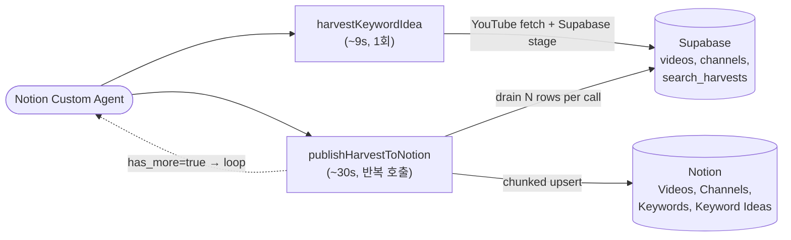

# 유피디 v0.9 기획안

> **태그**: `PRD` · `프로덕트`
> **수명**: 출시 시점에 동결
> **독자**: PM·디자이너·구현 전 엔지니어
> **명명**: 유피디 v0.9 기획안

---

> 🚀 **제품 정의**: 유피디 제품 개요 — 버전 무관한 제품 정체성·핵심 가치·스킬 카탈로그·권한 철학은 이 문서를 참조.
> **설계 스펙**: 유피디 v0.9 설계문서
> **상위 기획**: 유피디 v0.8 기획안
> 이 문서는 **기획안(PRD)**입니다. *왜·무엇·언제*에 집중하며, *어떻게*는 설계 스펙에서 다룹니다.

---

# 👀 이슈

## 해결하고자 하는 이슈

v0.8까지 운영되던 `trackKeywordIdeasDue` 노션 워커 툴이 한 키워드의 결과를 가져와 노션에 쌓는 전 과정을 단일 capability 호출에서 처리하도록 설계되어 있어, **검색 결과가 50개를 넘는 모든 키워드에 대해 60초 타임아웃으로 실패**한다.

원인은 두 가지가 합쳐진 구조적 제약이다.

1. **Notion Workers 플랫폼의 60초 capability 실행 한도** (`Worker operation 'runCapability' timed out after 60000ms`)
2. **Notion API 평균 3 req/sec** 의 글로벌 레이트 리밋. 영상 1개 upsert에 query + create/update 2회 호출이 필요하므로, 300개 결과를 한 번에 처리하려면 산술적으로 5분 이상 걸린다.

운영자가 사용자 요청대로 사이클당 300개 결과를 누적해야 한다고 명시했기에 단순히 `results_per_keyword`를 30으로 낮추는 식의 회피는 채택할 수 없다.

## 누구의 이슈이고, 언제 발생하나요?

- **Notion Custom Agent**: "Run repeat searches for due keyword ideas" 호출 시마다 60초에 깨져 다이제스트가 끊긴다. 같은 키워드를 다시 호출해도 동일한 모드라 회복 불가.
- **운영자 (PM·콘텐츠 기획자)**: 다이제스트 실패 → Notion `Keyword Ideas` row 가 `검색 중` 상태로 멈춰 운영 상태가 불투명해진다. 수동으로 row 상태를 되돌려야 한다.
- **엔지니어**: 같은 트레이스가 반복되는데 60초 ceiling 자체를 못 늘리기 때문에 디버깅·재시도로 풀 수 없다.

## 현재 가지고 있는 근거

- 프로덕션 에러 로그: `Worker operation 'runCapability' timed out after 60000ms`가 매 사이클마다 반복.
- Notion 공식 문서: [Request limits](https://developers.notion.com/reference/request-limits) — “평균 3 req/sec” + HTTP 429 + Retry-After 명시. Enterprise 포함 전 플랜 공통, 상향 옵션 없음.
- 코드 trace: keyword 1개 = REST `search/keyword` 1회 + Notion API `~3R + 10`회 호출 (`R = results_per_keyword`). R=300 → 910 calls / 3 rps ≈ 303s.
- `@notionhq/workers` v0.4.0 API surface 점검 결과: `worker.tool()` 외에 cron/schedule/trigger 가 없음 → 워커 자체가 스케줄러 역할을 할 수 없음.
- YouTube `search.list` `nextPageToken`은 수시간 내 만료되므로 "이번 사이클에 page 3까지, 다음 사이클에 page 4부터" 식의 분할은 불가.

## 이슈의 우선순위가 높은 이유

1. **다이제스트 핵심 자동화가 완전히 죽어있다** — 키워드 트래킹은 유피디의 일일 사이클 운영 SSOT를 채우는 입력. 이게 막히면 수동 백필 외 회복 경로가 없다.
2. **단순 회피책으로 해결 불가** — `results_per_keyword`를 내리면 위 제품 요구사항(300개 누적) 위반. nextPageToken 분할도 YouTube 측 한계로 불가. 구조적 분리가 유일한 해법.
3. **Supabase 스테이징 자산이 후속 작업의 기반이 된다** — 대시보드·분석 컨슈머·다른 데이터 추출 자동화는 모두 canonical 비디오/채널 테이블을 필요로 한다. 이번 결정은 그 SSOT를 같이 만든다.

---

# 💭 제안

## 이 이슈를 어떻게 해결하려고 하나요?

**검색(fetch)과 발행(publish)을 두 개의 노션 워커 툴로 분리**하고, 그 사이에 **Supabase를 스테이징 레이어**로 둔다.

- **Tool A `harvestKeywordIdea`** (~9초) — 한 번에 YouTube에서 300개를 가져와 Supabase 의 canonical `videos` / `channels` 와 `search_harvests` 세션·정션 테이블에 적재. Notion에는 `Keyword Ideas` 상태만 `검색 중`으로 바꾼다.
- **Tool B `publishHarvestToNotion`** (~30초/호출) — Supabase 에서 미발행 행을 `batch_size` (기본 30) 만큼 읽어 Notion에 upsert. 응답에 `has_more`를 실어 보내 Custom Agent가 같은 툴을 `has_more=false`가 될 때까지 반복 호출하게 한다. 마지막 호출에서 Keywords-DB relation merge + Keyword Ideas `검색 완료` 마감.

이 분리로 모든 단일 capability 실행이 60초 미만으로 끝나면서, 사이클당 300개 누적 요구도 충족한다. *구체적인 데이터 모델·REST 계약·알고리즘은 설계 스펙에서 다룬다.*

## 고려한 다른 대안

| 대안 | 설명 | 기각 이유 |
| --- | --- | --- |
| **A. `results_per_keyword` 30으로 축소** | 한 사이클당 상위 30개만 캡처 (스냅샷 모델) | 운영자가 300개 누적 모델을 product requirement로 명시 |
| **B. 배치 lookup 만 도입** | `findPageIdsByRichTextIn` 만으로 Notion 호출 수 절반 감축 | 절감해도 R=300이면 500+ calls × 0.33s ≈ 165s — 여전히 60초 초과 |
| **C. nextPageToken 분할 + 진행 컬럼 추가** | Notion Keyword Ideas DB에 `다음 페이지 토큰`·`진행 페이지` 컬럼 추가, 사이클 사이에 이어 받기 | YouTube `search.list`의 nextPageToken은 수시간 내 만료. 사이클 간 분할 불가능 |
| **D. Vercel Cron → Notion Worker capability HTTP 호출** | 60초 우회 시도 | Notion Worker capability 자체가 60초 ceiling이라 cron이 호출해도 동일하게 깨짐 |
| **E. 로직 전체를 Vercel Function으로 이전** (Fluid Compute, maxDuration 300s) | 노션 워커에서 분리 | Notion workspace OAuth, 8개 데이터 소스 env, agent UI surface 재구성 비용이 큼. 노션 컨텍스트 가치 손실 |
| **F (채택). 검색·발행 분리 + Supabase 스테이징** | YouTube fetch는 1회로 끝내고, Notion 발행만 60초 단위로 청크 | — |

## 이 방식을 선택한 이유

- YouTube quota는 1회만 소비 (사이클 간 분할 안 함) → 결과 일관성 보장.
- 모든 단일 capability 실행이 60초 이내로 안정 수렴.
- Supabase를 SSOT로 가져가는 부수 효과: 대시보드·분석 등 비-Notion 컨슈머가 직접 조회 가능 (제품 로드맵의 다음 단계와 정렬).
- `notion_page_id` 캐싱과 `notion_relation_synced` 플래그로 부분 실패 시 자연스러운 재개 — 별도 락이나 상태머신 불필요.
- 노션 워커가 가진 workspace OAuth·data source env·agent UI surface는 그대로 유지.

## 솔루션의 모습 (개요)

세부 아키텍처·엔드포인트·데이터 모델은 [유피디 v0.9 설계문서](./유피디%20v0.9%20설계문서.md)를 참조.

## 이슈가 해결되었는지 어떻게 판단하나요?

측정 가능한 성공 지표:

- **단일 capability p95 실행 시간 ≤ 45초** (60초 ceiling 대비 25% 안전 마진)
- **단일 keyword (results_per_keyword=300) 종단 처리 성공률 100%** — Tool A 1회 + Tool B ~10회 반복으로 timeout 없이 종결
- **부분 실패 후 재개 정합성**: Tool B를 임의 시점에 강제 중단하고 같은 `harvest_id`로 재호출 시 누락·중복 없음
- **기능 회귀 부재**: 기존 `videosByKeyword`, `channelAllVideos`, `snapshotVideos`, `snapshotChannels` 4개 툴은 동일하게 동작 (회귀 테스트로 검증)

## 이 해결책이 서비스를 업그레이드하는가?

- **빠르고**: YouTube fetch는 단 1회, 이후 발행 청크는 병렬 worker 호출로 wall-clock 압축 가능
- **확장 가능하고**: canonical `videos`/`channels` 테이블이 다른 컨슈머의 SSOT가 되어 다이제스트·대시보드·분석을 같은 데이터 위에서 운영 가능
- **비용 효율적이며**: YouTube quota를 사이클당 ~610 units로 고정 (분할로 인한 search.list 중복 호출 회피)
- **품질이 높다**: `notion_page_id` 캐시 + `notion_relation_synced` 플래그로 멱등성·부분 실패 회복이 데이터 레이어에 내장. 상태 머신 디버깅 부담이 없다.

---

# 🛫 계획

## 무엇을 구축하는가?

1. **Supabase 스키마** — `channels` / `videos` canonical 테이블, `search_harvests` 세션, `search_harvest_videos` · `search_harvest_channels` 정션. RLS deny-all + service-role 전용.
2. **`packages/db` Drizzle 스키마** (`youtube.ts`, `harvests.ts`) — 위 5개 테이블의 타입드 SSOT.
3. **`packages/supabase` 리포지토리** (`youtube.ts`, `harvests.ts`) — 배치 upsert, 미발행 row 조회, mark-published 트랜잭션, finalize, synced page id 수집.
4. **`packages/api/rest/harvests/`** — `createHarvest` / `getHarvestSummary` / `listHarvestItems` / `markHarvestPublished` / `finalizeHarvest` 유스케이스 + `HarvestNotFoundError` · `HarvestNotReadyError`.
5. **`apps/web` REST 라우트 5개** — `POST /harvests`, `GET /harvests/[id]`, `GET /harvests/[id]/items`, `POST /harvests/[id]/mark-published`, `POST /harvests/[id]/finalize`. `withYoupdRest` 에 404/409 매핑 추가.
6. **노션 워커 helper** — `findPageIdsByRichTextIn` 배치 lookup, `writeChannelRow` / `writeVideoRow` 변형 (사전 해소된 page id 받음).
7. **노션 워커 툴 2개** — `harvestKeywordIdea`, `publishHarvestToNotion`. 기존 `trackKeywordIdeasDue` 제거.

## 언제 준비되나요?

총 **약 1.5일** (전체 v0.9 구현 + 검증).

| Phase | 기간 | 결과물 |
| --- | --- | --- |
| E0 설계 확정 | 0.25일 | v0.9 PRD + Tech Spec + ADR-020 작성 |
| E1 스키마 + 리포지토리 | 0.25일 | 마이그레이션 SQL, Drizzle 스키마, repo 함수 |
| E2 유스케이스 + REST 라우트 | 0.25일 | `packages/api/rest/harvests`, 5개 Next.js route handler |
| E3 노션 워커 툴 | 0.25일 | 배치 lookup helper, harvestKeywordIdea, publishHarvestToNotion |
| E4 단위 + 통합 테스트 | 0.25일 | vitest 22개, 실제 Supabase에 대한 11-assertion 통합 스크립트, REST 14개 시나리오 |
| E5 QA·회귀 검증 | 0.25일 | 4개 기존 툴 회귀 + production smoke (results_per_keyword=300 풀런) |

## 론칭 체크리스트

- **질문 1**: 무엇을 만드는지 모두가 알고 있나요?
    - [x] **내부 합의**
        - [x] PRD·Tech Spec·ADR을 Notion 문서 DB에 적재
        - [x] PR #17 description에 작업 분량·검증 결과 정리
- **질문 2**: 잘 작동할 것이라고 확신하나요?
    - [x] **품질**
        - [x] E2E 테스트 (설계 스펙 §성공 지표 참조)
        - [x] 이전 버전 시나리오 회귀 (기존 4개 툴 typecheck + lint 통과)
        - [x] 재시도·부분 실패 회복 시나리오 (Tool B를 임의 시점에 멈추고 재호출 → 누락 row만 재처리, 멱등성 확인)
    - [ ] **측정**
        - [ ] capability 실행 시간 메트릭을 `search_sessions` 또는 별도 audit table에 적재 (후속 작업)
        - [ ] `search_harvests.status` 분포 일일 집계 대시보드 (Supabase 직접 조회)
- **질문 3**: 검증 단계가 어떻게 되나요?
    - [x] **플랜**
        - [ ] 내부 워크스페이스에서 1주 운영하며 다이제스트 사이클 관찰
        - [ ] production 검증 통과 후 기존 `trackKeywordIdeasDue` 호출 흔적이 남아있는 자동화·문서 정리

## 핵심 스코프

| 포함 | 불포함 |
| --- | --- |
| Supabase canonical `channels` · `videos` 도입 | 다른 YouTube 엔티티 (comments, snapshots) 의 canonical 이전 — 기존 툴 그대로 |
| `search_harvests` 세션 + 두 정션 테이블 | 사이클 간 누적 분석 (시계열, snapshot 트래킹) — 후속 |
| 두 툴 패턴 (`harvestKeywordIdea` + `publishHarvestToNotion`) | Vercel Cron 자동 트리거 — 1차는 Notion Custom Agent 호출 |
| 5개 REST 라우트 + auth/error 매핑 확장 | `/harvests` 라우트의 Rate limit / quota gate 강화 — 기존 `withYoupdRest` 정책 그대로 |
| 기존 `trackKeywordIdeasDue` **완전 제거** | 구버전 capability 호환 shim — 호출자 0으로 확인되어 불필요 |
| 노션 워커 배치 lookup helper (`findPageIdsByRichTextIn`) | 노션 batch write — Notion API가 지원 안 함 |

## 열린 질문

> ❓
> - 사이클 간 keyword 가 동일한 영상을 다시 발견할 때 `videos.notion_page_id` 캐싱이 노션 page 업데이트만 일으키므로 안전하지만, **`마지막 수집일` 같은 시점 컬럼은 어떤 의미로 누적할지** 결정 필요. 현재는 마지막 발견일 덮어쓰기.
> - **Tool A 도중 Notion `검색 중` 상태 업데이트가 실패하면** harvest는 만들어졌지만 노션 상태와 어긋난다. 다음 호출에서 `findActiveHarvest`로 회복 가능한지 시나리오 점검 필요 (Tool B에 idea_page_id 옵션 인자로 받아 재해소하는 방안 검토).
> - **300개 누적이 사이클 간 어떻게 비교되어야 하는가?** 사이클 N과 사이클 N+1이 같은 video 를 발견하면 “트래킹 키워드 → 비디오” 관계는 단일 row지만, 시점 비교용 시계열은 별도 컬럼이 필요. v0.10 의 후속 결정 사항.

## 다음 액션

- [ ] PR #17 머지 후 Supabase 마이그레이션 적용 (Dashboard SQL Editor 또는 `supabase db push`)
- [ ] Vercel 재배포 + Notion Worker 재배포
- [ ] Notion Custom Agent instruction 갱신: "harvestKeywordIdea → publishHarvestToNotion을 has_more=false 까지 반복"
- [ ] production smoke: `results_per_keyword=50` 1키워드 → 풀 사이클 → `results_per_keyword=300` 풀 사이클
- [ ] 1주 운영 후 v0.9 릴리즈 노트 작성, 열린 질문 3건을 ADR 또는 v0.10 기획안으로 승격
