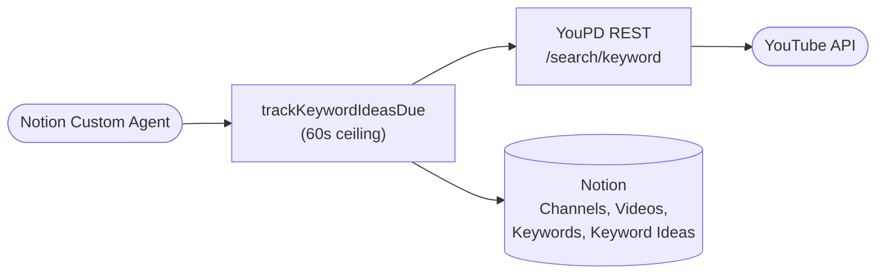
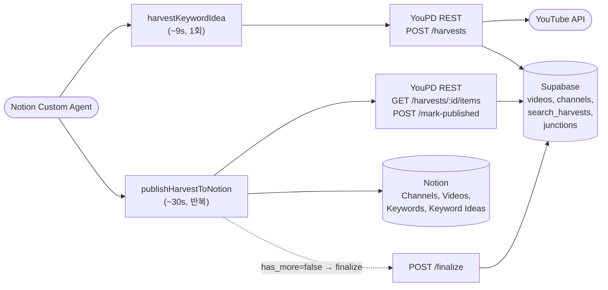
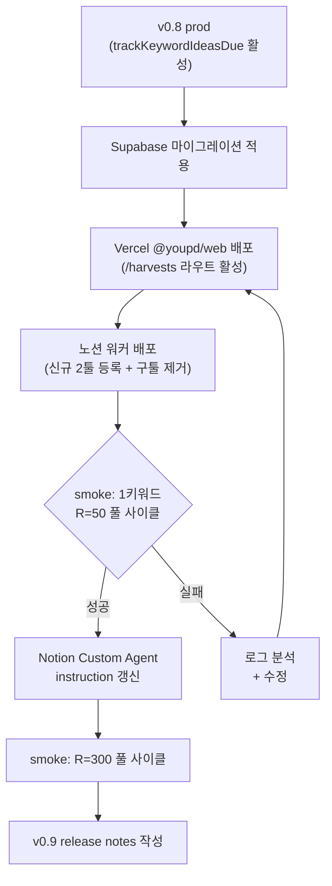

# 유피디 v0.9 설계문서

> **태그**: `설계` · `엔지니어링`
> **수명**: 출시 시점에 동결. 다음 버전 명세는 새 Tech Spec 페이지
> **독자**: 엔지니어·QA·신규 개발자
> **명명**: 유피디 v0.9 설계문서

---

> 🧭 **상위 기획안**: 유피디 v0.9 기획안
> **제품 정의**: 유피디 제품 개요
> **이전 버전 설계**: 유피디 v0.8 설계문서 (Supersedes)
> 이 문서는 **기술 스펙**입니다. *왜·무엇·언제*는 기획안에서, *어떻게*는 이 문서에서 다룹니다.

---

# 이슈 설명

`trackKeywordIdeasDue` 노션 워커 툴은 단일 capability 호출에서 다음을 모두 수행하도록 설계되어 있다.

1. Notion `Keyword Ideas` DB에서 `다음 스케줄러 추출` formula 가 true 인 row 들을 조회 (`keyword_idea_limit`개)
2. 각 row의 keyword 에 대해 YouPD REST `/api/youpd/rest/search/keyword` 호출 — 페이지네이션해 최대 `results_per_keyword`개 (기본 300)
3. 검색 결과의 channels[] / videos[] 를 Notion 의 Channels DB · Videos DB 에 upsert
4. Keywords DB row 를 upsert 하고 Keywords→Videos / Keywords→Channels relation 을 merge
5. Keyword Ideas row 상태를 `검색 완료`로 업데이트, 마지막 검색일·검색 횟수·트래킹 슬롯 갱신

문제는 (3)·(4) 단계에서 발생하는 Notion API 호출량이다. 1 keyword × R=300 영상이면 `3R + 10 ≈ 910` 호출이 필요하고, [Notion API 평균 3 req/sec](https://developers.notion.com/reference/request-limits) 한도에서 wall-clock 5분+ 가 소요된다. `@notionhq/workers` 의 capability 실행은 60초 ceiling 이라 모든 keyword 가 timeout 으로 깨진다. 자세한 배경·시간 모델은 상위 PRD §👀 이슈를 참조.

## 목표

- **모든 단일 capability 실행이 60초 이내로 종결.** Tool A (harvest) ≤ 10초, Tool B (publish chunk) ≤ 45초.
- **사이클당 300개 누적 모델 유지.** YouTube 검색은 한 번에 끝내고, 노션 발행만 청크로 분할.
- **부분 실패 시 자연 재개.** 노션 측 어떤 단계에서 실패해도 동일 input 재호출이 누락·중복 없이 진행되도록 데이터 레이어에 멱등성 내장.
- **Supabase가 캐노니컬 SSOT.** 다른 컨슈머 (대시보드·분석) 가 Notion 우회해 직접 조회 가능한 구조.
- **레거시 호환 X.** `trackKeywordIdeasDue` 는 완전히 제거 (운영 호출자 0건 확인됨).

## 목표가 아닌 항목

- **사이클 간 nextPageToken 분할** — YouTube 측 토큰 만료로 불가, 시도하지 않음.
- **Vercel Cron으로 Tool A 자동 트리거** — 1차는 Notion Custom Agent 호출. cron 추가는 v0.10+ 결정.
- **다른 YouTube 엔티티 (comments, snapshots) 의 canonical 이전** — `videos`/`channels` 만 우선. 기존 툴은 그대로.
- **Notion Worker 측 동시성 / 락** — 동일 keyword 의 동시 harvest는 멱등성으로 안전. 락 도입은 후속.
- **Quota guard 강화** — 기존 `withYoupdRest` + `runWithBudget` 정책 그대로.

# 해결책

## 하이 레벨 아키텍처

### Before

*문제 구간*: TK 호출 1회에 R(R=300) 영상의 Notion upsert가 동기 누적 → 5분+ → 60초에 깨짐.

### After

*핵심*: 한 capability 실행이 항상 60초 이내. YouTube fetch는 단 1회. 노션 발행은 청크 단위 + 멱등.

## 데이터 모델

### DB 분류 / 스키마 변경

마이그레이션: `supabase/migrations/20260602000000_init_youtube_canonical_and_harvests.sql`. Drizzle SSOT: `packages/db/src/schema/youtube.ts`, `packages/db/src/schema/harvests.ts`.

| DB / 테이블 | 속성 | 타입 | 설명 |
| --- | --- | --- | --- |
| `public.channels` | `channel_id` | text PK | YouTube channel id. PK로 자연 dedupe. |
| | `title` / `subscriber_count` / `view_count` / `video_count` / `published_at` / `url` | text·bigint·int·timestamptz·text | YouTube 정규화 메타. nullable. |
| | `notion_page_id` / `notion_synced_at` | text · timestamptz | 첫 publish 시 캐시. 이후 lookup 생략. |
| | `first_seen_at` / `last_seen_at` | timestamptz | 발견 시점 추적. |
| `public.videos` | `video_id` | text PK | YouTube video id. |
| | `channel_id` | text NOT NULL FK → `channels(channel_id)` ON DELETE RESTRICT | 채널 먼저 upsert 필수. |
| | `title` / `views` / `likes` / `comments` / `duration_sec` / `published_at` / `url` | text·bigint·int·timestamptz·text | nullable. |
| | `notion_page_id` / `notion_synced_at` | text · timestamptz | 캐시. |
| | `first_seen_at` / `last_seen_at` | timestamptz | |
| `public.search_harvests` | `id` | uuid PK | gen_random_uuid(). |
| | `keyword_idea_page_id` | text NOT NULL | Notion Keyword Ideas page id (감사용). |
| | `keyword` | text NOT NULL | 검색 키워드 문자열. |
| | `search_session_id` | uuid FK → `search_sessions(id)` | YouTube quota 감사 row 연결. |
| | `status` | text CHECK in (`fetched`,`publishing`,`published`,`failed`) | enum. |
| | `total_videos` / `total_channels` | int NOT NULL DEFAULT 0 | harvest 시점 카운트. |
| | `notion_keyword_page_id` | text | finalize 시 Keywords DB row id 저장. |
| | `finalized` | boolean NOT NULL DEFAULT false | finalize() 완료 플래그. |
| | `created_at` / `finished_at` | timestamptz | |
| `public.search_harvest_videos` | `(harvest_id, video_id)` | composite PK | junction. |
| | `harvest_id` | uuid FK → `search_harvests(id)` ON DELETE CASCADE | |
| | `video_id` | text FK → `videos(video_id)` ON DELETE RESTRICT | |
| | `position` | int NOT NULL | 검색 랭킹 (0-based). |
| | `notion_relation_synced` | boolean NOT NULL DEFAULT false | publish 진행 상태. |
| `public.search_harvest_channels` | `(harvest_id, channel_id)` | composite PK | junction. |
| | `notion_relation_synced` | boolean NOT NULL DEFAULT false | |

**인덱스**:
- `channels (notion_synced_at)`
- `videos (channel_id)`, `videos (notion_synced_at)`
- `search_harvests (keyword_idea_page_id, created_at)`, `search_harvests (status)`
- `search_harvest_videos (harvest_id)`, `search_harvest_channels (harvest_id)`

**RLS**: 5개 테이블 모두 `enable row level security` + `deny_all` policy for `anon, authenticated`. 서비스 롤 클라이언트만 접근 (AGENTS.md 원칙).

## API 계약

### 설계 원칙

- **Bearer auth (`YOUPD_API_TOKEN`)** — 모든 라우트 `withYoupdRest` 래퍼 통과. 누락·불일치 시 401.
- **`{ data, meta }` 봉투 일관성** — 기존 `wrapRestEnvelope` 패턴 그대로.
- **에러는 status code 로 표현** — `HarvestNotFoundError` → 404, `HarvestNotReadyError` → 409, Zod 실패 → 400.
- **`POST /harvests` 만 외부 부수효과 (YouTube quota 소비)** — 나머지 4개는 read-or-update Supabase만.

### 엔드포인트 카탈로그

| 엔드포인트 | 대응 기능 | 응답 크기 | 호출 주체 |
| --- | --- | --- | --- |
| `POST /api/youpd/rest/harvests` | YouTube fetch + Supabase 적재 + harvest 세션 생성 | 소 (메타만) | 노션 워커 (`harvestKeywordIdea`) |
| `GET /api/youpd/rest/harvests/[id]` | harvest 상태 + unpublished 카운트 | 소 | 노션 워커 (`publishHarvestToNotion`) |
| `GET /api/youpd/rest/harvests/[id]/items?kind=video\|channel&size=30&include_published=false` | 미발행 row 배치 | 중 (size에 따라) | 노션 워커 |
| `POST /api/youpd/rest/harvests/[id]/mark-published` | `[{kind,id,notion_page_id}]` 일괄 마킹 | 소 | 노션 워커 |
| `POST /api/youpd/rest/harvests/[id]/finalize` | 최종 마감 (`notion_keyword_page_id` 저장) | 소 | 노션 워커 |

**입력 검증**: Zod 스키마 (`packages/api/src/rest/harvests/`). 핵심:

- `CreateHarvestInputSchema`: `keyword` 1~200자, `keyword_idea_page_id` 1~64자, `results_per_keyword` 1~500 default 300.
- `ListHarvestItemsInputSchema`: `kind` enum, `size` 1~100 default 30.
- `MarkHarvestPublishedInputSchema`: `items` 1~200건, `kind` enum.
- `FinalizeHarvestInputSchema`: `notion_keyword_page_id` 1~64자.

## 알고리즘·계산식

- **`createHarvest` orchestration** (서버 측 use case):
    1. `searchKeyword(input)` → `{ videos[], channels[], quota_session_id?, units_consumed, search_pages? }`
    2. `upsertChannels(rows)` — **반드시 videos 보다 먼저** (videos.channel_id FK)
    3. `upsertVideos(rows)`
    4. `createHarvest({ ... totalVideos, totalChannels })` → `id` 반환
    5. `linkHarvestChannels(id, channelIds.dedupe())`
    6. `linkHarvestVideos(id, videos.map((v, idx) => ({ videoId, position: idx })))`
    7. 반환: `{ harvest_id, keyword, total_videos, total_channels, units_consumed, search_pages, quota_session_id }`
- **`listHarvestItems` 자동 상태 전이**:
    - 호출 시 `getHarvestRow` 후 status가 `fetched`면 `setHarvestPublishing` 호출 (멱등 — 이미 publishing 이면 no-op).
    - `include_published=true` 인 경우 `videos/channels` 배열은 빈 채로, `synced_video_page_ids` + `synced_channel_page_ids` 만 채워 반환 (finalize 단계용).
- **`markHarvestItemsPublished` 트랜잭션**:
    - 한 DB 트랜잭션 안에서 (a) `videos/channels` 의 `notion_page_id`·`notion_synced_at` 업데이트 + (b) junction 의 `notion_relation_synced=true` 갱신. 부분 실패 시 둘 다 롤백 → 정합성 보장.
- **`finalizeHarvest` 가드**:
    - `finalized=false` 일 때만 `unpublishedVideos + unpublishedChannels > 0` 이면 `HarvestNotReadyError` 던짐 → 409.
    - 이미 `finalized=true` 이면 검증 건너뛰고 동일 값으로 다시 update (멱등 no-op).
- **노션 측 `publishHarvestToNotion` execute flow**:
    1. Channels 먼저 (`GET items?kind=channel&size=N`) → `findPageIdsByRichTextIn` 배치 lookup (50/chunk OR filter) → `writeChannelRow` (existing 또는 create) → `POST /mark-published` 일괄
    2. Videos (`GET items?kind=video&size=N`) → channels 의 page id 를 다시 배치 lookup → video 의 미발행 분 배치 lookup → `writeVideoRow` 순차 → `POST /mark-published` 일괄
    3. `GET /harvests/[id]` 로 잔여 확인. `unpublished_videos + unpublished_channels > 0` → return `{ has_more: true }`
    4. 잔여 0 + `finalized=false` 면 finalize 분기:
        - `GET items?kind=video&include_published=true&size=1` 으로 `synced_video_page_ids`, `synced_channel_page_ids` 수집
        - `upsertKeywordRow` 으로 Keywords DB row 확보
        - `mergeRelationPropertyByName` × 3 (Keywords→Videos, Keywords→Channels, KeywordIdeas→Keywords)
        - Keyword Ideas row 의 상태=`검색 완료`, `마지막 검색일`, `검색 횟수++`, `트래킹 슬롯` 갱신 (slot은 `plannedSlot` 함수로 계산, 값 있을 때만 write)
        - `POST /finalize` 로 harvest 마감
    5. 이미 finalize 된 harvest 에 재호출되면 즉시 `{ has_more: false, finalized: true }` 반환 (no-op).

## 인증·권한·레이트리밋

- **REST 라우트**: Bearer `YOUPD_API_TOKEN` 검증 (`requireYoupdRestToken`). 클라이언트는 노션 워커만.
- **DB**: 모든 캐노니컬·harvest 테이블은 RLS deny-all + 서비스 롤 (`SUPABASE_SERVICE_ROLE_KEY`) 만 우회. anon/authenticated 직접 접근 차단.
- **YouTube quota**: 기존 `executeWithKeyRotation` + `runWithBudget` 그대로 — `createHarvest` 가 `searchKeyword` 호출하므로 자동 적용.
- **Notion API**: 평균 3 req/sec 한도 — 워커 측 `paceYoupdRest` (24 req/60s 토큰 버킷) 는 REST API 호출 페이서이고, Notion API 호출은 SDK 가 직접 처리. Tool B 의 청크 사이즈를 30으로 둠으로써 자연스럽게 분당 < 90 calls 로 수렴.

## 설정·환경 변수

| 변수 | 용도 | 디폴트 | 관리 위치 |
| --- | --- | --- | --- |
| `DATABASE_URL` | Supabase Postgres 연결 (`packages/db/src/client.ts`) | — | Vercel env / `.env.local` |
| `YOUPD_API_TOKEN` | REST Bearer auth | — | Vercel env + Notion Worker secret (parity) |
| `YOUPD_API_BASE_URL` | 노션 워커가 호출할 REST host | — | Notion Worker secret |
| `SUPABASE_URL` / `SUPABASE_ANON_KEY` / `SUPABASE_SERVICE_ROLE_KEY` | Supabase 서버 클라이언트 | — | Vercel env |
| `SUPABASE_PUBLISHABLE_KEY` / `SUPABASE_SECRET_KEY` | Supabase Cloud 새 키 이름 (anon/service_role 리네이밍 대응) | — | Vercel env + `turbo.json` globalEnv |
| `YOUPD_INTER_PAGE_DELAY_MS` | YouTube 페이지 간 throttle | 150ms | Vercel env (변경 없음) |

## 배포 토폴로지

- **`@youpd/web` (Vercel Fluid Compute, Node 24)** — 신규 5개 REST 라우트. `withYoupdRest` 가 인증·에러 매핑·외부 의존성 (Supabase, YouTube SDK) 모두 wrap.
- **노션 워커 (`@notionhq/workers` 호스팅)** — `apps/notion-worker` 빌드 후 `ntn workers deploy`. 두 신규 툴 등록, `trackKeywordIdeasDue` 제거.
- **Supabase** — 마이그레이션 적용. 로컬은 `pnpm db:reset`, 원격은 Dashboard SQL Editor 또는 `supabase db push`.

**롤아웃 순서** (의존성 순):
1. Supabase 마이그레이션 적용
2. Vercel `@youpd/web` 배포 (신규 REST 라우트 활성화)
3. 노션 워커 배포 (신규 툴 등록 + `trackKeywordIdeasDue` 제거)
4. Notion Custom Agent instruction 갱신

**롤백 절차**:
- 노션 워커 이전 버전 재배포 → 신규 툴 제거, `trackKeywordIdeasDue` 복귀 (불가능: 코드 제거됨 → Git revert + 재빌드 필요). 실질적 롤백 비용 큼 → 우선 forward fix.
- Supabase 마이그레이션 rollback SQL: 없음. 신규 테이블 5개는 isolated 라 `drop table ... cascade` 로 안전 제거 가능 (단 운영 데이터 손실).

## UI/UX 변화

- **Notion Custom Agent**: 호출 패턴이 1툴 → 2툴 순차로 변경. agent instruction 에 "Run repeat searches → harvest 1회 + publish 반복" 가이드 명시.
- **Notion `Keyword Ideas` row 상태 전이**: 기존 `예정` → `검색 중` → `검색 완료` 흐름 동일. 다만 `검색 중` 구간이 더 길게 유지 (publish 반복 동안).
- **운영자 가시성**: harvest 진행 상황은 Supabase `search_harvests` 테이블 + Studio 또는 Dashboard 에서 직접 확인 가능. Notion 측에는 별도 컬럼 추가 없음.

## 인스트럭션·설정 변경

> 📜
> **노션 Custom Agent 호출 가이드 (v0.9)**
> 1. 사용자가 “이번 사이클 키워드 다이제스트 돌려줘” 같이 호출하면, **due 키워드 한 개를 골라 `harvestKeywordIdea({ keyword_idea_page_id })` 호출**.
> 2. 반환된 `harvest_id` 를 가지고 **`publishHarvestToNotion({ harvest_id })` 를 응답의 `has_more === false` 까지 반복 호출**.
> 3. 한 키워드가 끝나면 다음 due 키워드로 이동 (1번부터 반복).
> 4. 호출 실패 (timeout, 5xx) 시 동일 input 으로 재호출 — 멱등성으로 안전.

# 리스크

## 기존 버전과 호환되지 않는 변경 사항이 있나요?

- **`trackKeywordIdeasDue` 완전 제거** → 호출자 코드/문서가 남아있으면 즉시 깨짐. 사전 grep 결과 운영 호출자 0건 확인. 외부 자동화 문서·플레이북 정리 필요.
- **신규 5개 REST 라우트는 추가만** — 기존 라우트 시그니처 변경 없음. 기존 `videosByKeyword`·`channelAllVideos`·`snapshotVideos`·`snapshotChannels` 4개 노션 워커 툴은 동일.

## 보안·개인정보

- Supabase canonical `videos`/`channels` 는 공개 YouTube 데이터만 보관. PII 없음.
- 서비스 롤 키는 Vercel server-only env. `NEXT_PUBLIC_*` 으로 절대 노출 안 함 (AGENTS.md 원칙).
- RLS deny-all 로 anon/authenticated 직접 접근 차단. 외부 클라이언트는 항상 `withYoupdRest` Bearer 통과해야 함.

## 백엔드 부하·외부 의존성

- **YouTube quota**: keyword 1개 (R=300) 당 ~610 units (기존과 동일). 사이클 분할 안 함 → 추가 비용 없음.
- **Notion API**: Tool B 호출 1회당 ~100 calls (batch_size=30 기준) → 30초에 분산되어 3 rps 한도 안에 안정 수렴.
- **Supabase**: harvest row + 정션은 합쳐도 1 사이클당 ~320 rows 추가. canonical 테이블은 deduplication 으로 사이클 간 누적 증가율 낮음.

## 의존성

- `@notionhq/workers` v0.4.0 — capability API surface 그대로 사용. 향후 SDK 가 schedule/cron 을 도입하면 cron 자동화로 확장 가능.
- `drizzle-orm` ^0.36.4 — 신규 schema 도 기존 패턴 그대로.
- `next` 16.2.6 + `@vercel/config` — REST 라우트는 App Router App Route Handler 패턴.
- `@youpd/youtube` — `searchKeyword()` 가 반환하는 `VideoSummary` / `ChannelSummary` 스키마에 의존. 필드 추가는 호환되지만 제거는 마이그레이션 필요.

# 다른 해결책

## A. `results_per_keyword` 30 으로 영구 축소 (스냅샷 모델)

- 한 사이클당 상위 30 개만 캡처 — Notion 호출 ~100건 → 60초 안에 안정 수렴.
- *기각 이유*: 운영자가 “사이클당 300 개 누적”을 product requirement 로 명시. 트래킹 도구의 시계열 신호가 약해짐.

## B. Notion 배치 lookup 만 도입

- `findPageIdsByRichTextIn` 으로 lookup 호출 수만 절반 감소 — R=50 까지 60초에 들어옴.
- *기각 이유*: R=300 에서는 여전히 ~500+ calls → 165s 소요. 60초 ceiling 못 통과.

## C. nextPageToken 분할 + Notion 컬럼 추가

- Keyword Ideas DB 에 `다음 페이지 토큰`·`진행 페이지` 컬럼 추가, 사이클 사이에 이어 받기.
- *기각 이유*: YouTube `search.list` 의 nextPageToken 은 수시간 내 만료. 사이클 간 분할 불가.

## D. Vercel Cron → Notion Worker capability HTTP 호출

- 60초 우회 시도.
- *기각 이유*: Notion Worker capability 자체가 60초 ceiling 이라 cron 이 호출해도 동일하게 깨짐.

## E. 로직 전체를 Vercel Function 으로 이전 (Fluid Compute, maxDuration 300s)

- 노션 워커에서 분리, Vercel Function 으로 capability + Notion 발행 다 처리.
- *기각 이유*: Notion workspace OAuth, 8 개 데이터 소스 env, agent UI surface 재구성 비용 큼. Notion 컨텍스트의 가치 손실.

→ 결론적으로 **F (채택) 검색·발행 분리 + Supabase 스테이징** 이 product 요구사항 (300 누적) 과 platform 제약 (60초) 을 동시에 만족하며, 부수 효과로 canonical SSOT 까지 얻을 수 있어 가장 단순하다.

# 적용 및 출시 계획

## 내부 전환 절차

- **전환 원칙**: Supabase → Vercel → 노션 워커 순. 의존성 거꾸로면 신규 툴이 호출할 라우트가 없어 깨짐.
- **롤백**: 노션 워커는 Git revert + 재배포로 v0.8 복귀. Supabase 신규 테이블은 isolate 라 `drop table cascade` 안전 (운영 데이터 손실 감수).

## 실험·기능 플래그

- 없음. 이번 변경은 trackKeywordIdeasDue 를 완전히 대체. 호출 surface 가 분리되어 있어 플래그 없이도 점진 적용 가능.

## 단계별 출시

| Phase | 기간 | 주요 작업 | 완료 기준 |
| --- | --- | --- | --- |
| E0 설계 확정 | 0.25일 | PRD·Tech Spec·ADR 작성 | 3개 문서 Notion 적재 |
| E1 스키마 + 리포지토리 | 0.25일 | 마이그레이션 + Drizzle + repo 함수 | `pnpm db:reset` 통과, 통합 스크립트 1차 green |
| E2 유스케이스 + REST 라우트 | 0.25일 | `packages/api/rest/harvests` + 5개 route handler | typecheck + lint clean, 5개 라우트 vitest |
| E3 노션 워커 툴 | 0.25일 | 배치 lookup + 2개 신규 툴 + 구툴 제거 | typecheck + 라우트 14개 curl 시나리오 통과 |
| E4 단위 + 통합 테스트 | 0.25일 | vitest 22개 + 통합 스크립트 11 assertion + curl 14건 | 모두 green |
| E5 QA·회귀 검증 | 0.25일 | 기존 4개 툴 회귀 + production smoke (R=50 → R=300) | smoke 시나리오 통과, 60s timeout 0건 |

## 성공 지표

### 어떻게 확인하나요?

- **단일 capability p95 실행 시간 ≤ 45초** — 노션 워커 capability 로그에서 측정 (Tool A + Tool B 각각).
- **단일 keyword (R=300) 종단 처리 성공률 100%** — Tool A 1회 + Tool B 반복 → 마지막 호출 `finalized: true` 도달.
- **부분 실패 후 재개 정합성** — Tool B 강제 중단 후 재호출 시 누락·중복 없음 (`search_harvests.total_videos === sum(notion_relation_synced)` 인지 검증).
- **기능 회귀 부재** — `videosByKeyword`·`channelAllVideos`·`snapshotVideos`·`snapshotChannels` 4개 툴 production 호출 결과 v0.8 과 동일.

### 모니터링·알림

- **`search_harvests` 상태 분포** — Supabase Studio 직접 조회. `status='failed'` 또는 `status='publishing'` 24시간+ 잔존 시 알림 필요 (수동 점검).
- **`search_sessions.units_consumed` 일일 합계** — YouTube quota 일일 한도 (10,000) 대비 모니터링. 기존 quota gate 그대로 동작.
- **노션 워커 capability error rate** — Notion Workers Studio 에서 60초 timeout 발생 0건 확인.

# 다음 액션

- [ ] PR #17 머지
- [ ] Supabase 원격 마이그레이션 적용 (Dashboard SQL Editor 또는 `supabase db push`)
- [ ] Vercel preview/production 배포
- [ ] 노션 워커 재배포 (`ntn workers deploy`)
- [ ] Notion Custom Agent instruction 갱신: harvest → publish 반복 패턴 명시
- [ ] R=50 1키워드 풀 사이클 smoke
- [ ] R=300 풀 사이클 smoke
- [ ] v0.9 릴리즈 노트 작성
- [ ] 열린 질문 3건 처리 → 필요 시 ADR-021 또는 v0.10 기획안
