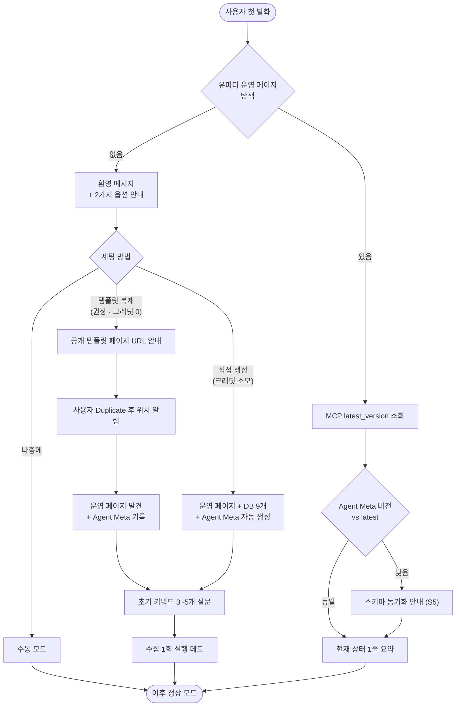

# 유피디 — 유튜브 기획/제작 커스텀 에이전트 기획안

<aside>
🤖

**목표**: 유튜브 채널의 *키콘텐츠·풀링콘텐츠 기획·제작 전 과정*을 한 명의 PD처럼 관장하는 커스텀 에이전트를 만든다.

**핵심 차별점**: 마켓플레이스에서 *아무 워크스페이스나* 다운받아도 첫 대화 한 번으로 9개 DB와 운영 페이지가 자동 세팅된다 — 즉 **0-세팅 온보딩**.

**기반 문서**: [뷰트랩 자체 구축 설계 — Notion DB + YouTube API + MCP](https://www.notion.so/Notion-DB-YouTube-API-MCP-c478864759b447d7aa2c2065f5547232?pvs=21)

**문서 버전 메모**: **v0.6 (2026-05-15)** — 커스텀 에이전트용 **Notion Worker를 tools-only**(관리형 `worker.sync`/managed DB 없음)로 고정하고, 대량 적재는 **YouPD REST** → 사용자가 복제한 템플릿 DB(**data source** 단위 upsert)로 정착시켰습니다. 변경 상세는 저장소 `docs/CHANGELOG.md` · `docs/adr/` 참고.

</aside>

## 1. 에이전트 개요

| 항목 | 값 |
| --- | --- |
| 이름 | **유피디** (You-PD) — *유튜브 기획·제작 PD 에이전트* |
| 아이콘 | 🎬 / agent_icon(shape=hat, color=red) |
| 한 줄 소개 | 키콘텐츠·풀링콘텐츠 기획부터 댓글 인사이트 추출, 대본 초안, 주간 리포트까지 일임하는 유튜브 PD 에이전트 |
| 주 사용자 | 유튜브 채널 운영자/기획자/PD, 시니어·복지·교육 등 *주제 기반 채널* 팀 |
| 핵심 가치 | ① 0-세팅 자동 온보딩 
② 뷰트랩 대체 지표(기여도·성과도·노출확률)
③ 키콘·풀링 기획 자동화
④ 댓글→원고 파이프라인 |
| 배포 대상 | Notion 마켓플레이스 (Public Template + Agent 번들) |

## 2. 설계 원칙

<aside>
💡

1. **자기완결성**: 외부 페이지/DB에 의존하지 않는다. 필요한 모든 리소스를 에이전트가 직접 만든다.
2. **재진입 가능**: 동일 워크스페이스에서 두 번째 대화부터는 기존 리소스를 *재발견*해서 재세팅하지 않는다.
3. **단계별 기획 절차 그대로 스킬화**: 사용자가 따로 학습하지 않아도 "키콘텐츠 1단계 해줘"라고 말하면 그대로 작동한다.
4. **권한 최소화**: 에이전트는 자기가 만든 작업 폴더 안에서만 쓰기 권한을 가진다.
5. **사람-AI 공동 작업**: 모든 산출물은 DB row로 떨어져서 사람이 검토·수정할 수 있다.
</aside>

## 3. 0-세팅 온보딩 플로우

### 3-1. 흐름도



### 3-2. 단계별 상세

- **Step 0. 운영 리소스 탐색 (대화 시작 시 항상)**
    - 탐색 키: 워크스페이스에 `유피디 운영 페이지` 또는 9개 DB가 있는지 검사.
    - 발견 방식 우선순위:
        1. 에이전트 인스트럭션에 메모해둔 운영 페이지 URL
        2. 워크스페이스 검색: `"유피디"`, `"Keywords 키워드"`, `"Videos 영상"` 등
    - 산출: `setupState ∈ {empty, partial, ready}`
- **Step 1. 빈 상태(empty) — 환영 & 옵션 안내**
    - 메시지 톤: PD 동료 "안녕하세요, 같이 채널 기획·제작 진행할 유피디예요. 시작하려면 작업 공간이 필요한데 두 가지 방법이 있어요."
    - 제시하는 옵션:
        1. **공개 템플릿 복제 (권장 · 크레딧 0)** — 미리 만들어둔 유피디 공개 템플릿 페이지로 가서 *Duplicate* 한 번이면 9개 DB + Agent Meta DB가 그대로 들어옴.
        2. **직접 생성 (크레딧 소모)** — 템플릿 페이지 방문이 번거롭다면 에이전트가 MCP `latest_version_schema`를 받아 직접 9개 DB를 생성 (Notion AI 크레딧 9~10회 차감).
        3. **나중에** — *수동 모드*로 진행. 채팅 안 임시 산출물만 제공.
    - 확인을 받기 전엔 어떤 리소스도 만들지 않는다.
- **Step 2a. 템플릿 복제 경로 (권장 · 크레딧 0)**
    - 에이전트가 공개 템플릿 페이지 URL을 채팅에 안내 ("이 페이지 우상단 Duplicate를 눌러주세요").
    - 사용자가 복제 완료하면 *"복제한 페이지 위치를 알려주세요"* 또는 워크스페이스 검색으로 자동 발견.
    - 발견 후 에이전트가 수행:
        1. 운영 페이지 URL을 인스트럭션에 기록
        2. `Agent Meta` DB의 row들에 현재 스키마 버전 기록 (MCP `latest_version` 값을 그대로 복사)
        3. 대시보드·기본 뷰 검증 (없으면 보완 — 크레딧 0~1회로 충분)
    - AI 크레딧: 0~1회.
- **Step 2b. 직접 생성 경로 (폴백 · 크레딧 소모)**
    - 사용자가 템플릿 경로를 거부했을 때만 진입.
    - 정해진 순서로 생성:
        1. `유피디` 운영 페이지 (사용자 사이드바 상단 또는 사용자가 지정한 부모)
        2. 그 페이지 안 `데이터베이스` 서브페이지
        3. MCP `get_latest_version_schema` 호출 → 받아온 스키마로 DB 9개 순차 생성 (`Keywords → Channels → Videos → Snapshots → Comments → Key Candidates → Pull Candidates → Search Sessions → Hot Video Daily`)
        4. `Agent Meta` 운영 DB 생성 + 9개 row 기록 (스키마와 동일 버전 기재)
        5. 메인 대시보드 뷰 (영상 찾기·채널 찾기·API 사용량·기획 칸반)
    - AI 크레딧: 9~10회 차감.
    - 생성 완료 후 운영 페이지 URL을 인스트럭션에 자동 기록.
- **Step 3. 초기 시드 수집 데모**
    - 채널 주제(예: "시니어 케어")·핵심 키워드 3~5개를 사용자에게 묻기.
    - 1개 키워드만 우선 `search_keyword`로 50건 수집 → Videos DB에 적재.
    - 결과를 표로 요약해서 보여주고, "여기까지가 1단계 수집입니다. 계속 진행할까요?" 안내.
- **Step 4. 부분 상태(partial) — 복구**
    - 일부 DB만 있거나 스키마가 변경된 경우.
    - 누락된 것만 추가 생성. 기존 데이터는 절대 덮어쓰지 않는다.
    - 변경 전 사용자에게 "이 DB가 누락되어 있어 추가하려고 합니다" 확인.
- **Step 5. 정상 상태(ready) — 1줄 현재 상태**
    - 첫 대화 응답 상단에 1줄로 현재 상태 표시.
    - 예: "키워드 12개 추적 중 · 마지막 수집 2일 전 · 풀링 후보 3건 진행 중"
    - 그 후 사용자가 요청한 작업으로 곧장 이동.

## 4. 에이전트가 관장하는 리소스

### 4-1. 운영 페이지 트리

```jsx
유피디 (운영 페이지, 에이전트 홈)
├── 📊 대시보드 (영상 찾기 / 채널 찾기 / 기획 칸반 / API 사용량 차트)
├── 📁 데이터베이스
│   ├── Keywords 키워드
│   ├── Channels 채널
│   ├── Videos 영상
│   ├── Video Snapshots 일별 스냅샷
│   ├── Comments 댓글
│   ├── Key Content Candidates 키콘텐츠 후보
│   ├── Pull Content Candidates 풀링콘텐츠 후보
│   ├── Search Sessions 검색 세션
│   └── Hot Video Daily 일자별 핫비디오
├── ⚙ Agent Meta (운영 메타 — DB 버전·스키마 동기화 기록)
├── 📓 가이드 (사용자 매뉴얼 — 자동 생성)
└── 🗒 주간 리포트 (자동 트리거 결과 누적)
```

### 4-2. 대시보드 위젯 (자동 생성)

| 위젯 | 소스 DB | 유형 | 용도 |
| --- | --- | --- | --- |
| 영상 찾기 | Videos | Table (키워드별 그룹, 성과도 desc) | 뷰트랩 "영상 찾기" 대체 |
| 채널 찾기 | Channels | Table (구독자 desc) | 경쟁 채널 탐색 |
| 기획 칸반 (키콘) | Key Content Candidates | Board (단계별) | 키콘텐츠 4단계 진행 상황 |
| 기획 칸반 (풀링) | Pull Content Candidates | Board (단계별) | 풀링콘텐츠 4단계 진행 상황 |
| API 사용량 | Search Sessions | Chart (일자별 units 합) | YouTube API 할당량 모니터링 |
| 핫비디오 | Hot Video Daily | Table (진입일 desc) | 오늘의 트렌드 |

### 4-3. Agent Meta DB — 스키마 버전 추적

마켓플레이스 릴리즈마다 9개 DB의 스키마가 진화할 수 있다. 운영 워크스페이스가 *어느 버전*에 머물러 있는지를 추적하고 **사용자 동의 후** 마이그레이션하기 위한 운영 메타 DB.

| 속성 | 타입 | 설명 |
| --- | --- | --- |
| DB 이름 | Title | 예: `Keywords`, `Videos` — 9개 row + 자기 자신(Agent Bundle) 1행 |
| DB 링크 | URL | 해당 DB의 워크스페이스 URL |
| 현재 버전 | Text | 예: `1.2.0` — 마지막으로 적용한 스키마 버전 |
| 최신 버전 (캐시) | Text | MCP `latest_version` 응답을 캐시한 값 |
| 속성 스냅샷 | Text (JSON) | 적용된 속성 이름·타입의 JSON 스냅샷 (diff 비교용) |
| 상태 | Select | `synced` · `outdated` · `migrating` · `unknown` |
| 마지막 동기화 | Date | 실제 마이그레이션이 적용된 시각 |
| 마지막 점검 | Date | MCP에서 버전을 가져와 비교한 마지막 시각 |
| 변경 로그 | Text | 최근 마이그레이션 요약 (자동 작성) |

추가로 1행짜리 **Agent Bundle** row를 둬서 전체 번들 버전·MCP 서버 URL·마지막 헬스체크 시각을 함께 저장한다.

## 5. 스킬 정의 — 기획·제작 과정 그대로

에이전트는 **6개 스킬 그룹 × 총 24개 스킬**로 구성된다. 사용자는 자연어로 호출하고, 에이전트는 스킬 정의에 따라 도구 호출 시퀀스를 결정한다.

### 5-1. 🛠 시스템 스킬 (온보딩·점검)

| # | 스킬 | 호출 예시 | 입력 | 동작 | 산출물 |
| --- | --- | --- | --- | --- | --- |
| S1 | **환경 점검** | "세팅 상태 봐줘" | 없음 | 운영 페이지·DB 존재 여부 검사 → `empty/partial/ready` 분류 | 상태 요약 + 다음 행동 제안 |
| S2 | **자동 세팅** | "처음부터 세팅해줘" | 채널 주제(선택) | 운영 페이지 + 9개 DB + 대시보드 일괄 생성, 인스트럭션에 URL 기록 | 유피디 트리 완성 |
| S3 | **스키마 복구** | "누락된 DB 채워줘" | 없음 | 설계 스펙과 비교해 누락된 DB/속성만 추가 | partial → ready |
| S4 | **사용량 점검** | "오늘 units 얼마 썼어?" | 날짜 범위 | Search Sessions 집계, 한도 대비 비율 계산 | 일별/주별 사용량 리포트 |
| S5 | **스키마 동기화** | "DB 버전 최신으로 맞춰줘" | 없음 | MCP `get_latest_version` 호출 → Agent Meta 비교 → 누락/변경된 속성만 사용자 동의 후 `updateDatabase` 적용. 필요 시 `get_latest_version_schema`로 전체 스키마를 받아 일괄 마이그레이션 | Agent Meta `outdated → synced`, 변경 로그 작성 |

### 5-2. 🎯 키콘텐츠 4단계 스킬

| # | 단계 | 스킬 | 호출 예시 | 사용 도구 | 산출물 |
| --- | --- | --- | --- | --- | --- |
| K1 | 1.수집 | **키워드 탐색** | "시니어 무릎통증 주제로 키워드 10개 찾고 검색해줘" | MCP `search_keyword` 병렬 + `videos.list`·`channels.list` **·** (**v0.6 대량 적재 우선**) Notion Worker `videosByKeyword` 또는 YouPD REST | Keywords·Videos·Channels DB 적재 |
| K2 | 2.검증 | **함정 체크** | "이 후보들 함정 점검해" | Notion DB read + 추론 | Key Candidates의 ①~⑤ 체크박스 자동 채움 + 근거 메모 |
| K3 | 3.명사판단 | **명사 유형 결정** | "명사 유형 정해줘" | `compute_metrics`  • Videos 지표 | 명사 유형 + 기능/문제 초안 |
| K4 | 4.판매논리 | **판매논리 작성** | "판매논리 3단으로 써줘" | Notion DB read + LLM | Key Candidates.판매논리 초안 |

### 5-3. 🧲 풀링콘텐츠 4단계 스킬

| # | 단계 | 스킬 | 호출 예시 | 사용 도구 | 산출물 |
| --- | --- | --- | --- | --- | --- |
| P1 | 1.주제 리서치 | **풀링 주제 탐색** | "이번 주 풀링 후보 10개 뽑아줘" | `search_keyword`  • `fetch_hot_chart`  • `fetch_trending_by_keyword` | Pull Candidates 후보 다수 생성 |
| P2 | 2.썸네일·제목 | **썸네일·제목 시안** | "썸네일/제목 시안 5개씩" | Videos DB read + `extract_title_pattern`  • 이미지 생성 | 썸네일 시안 + 제목 후보 텍스트 |
| P3 | 3.댓글 리서치 | **댓글 인사이트** | "이 영상들 댓글 분석해줘" | MCP `get_video_comments`(폴백) **·** Worker `videoComments`·REST (**v0.6 대량**) **·** `comments_tag_batch` | 댓글 인사이트 요약 + 감정/태그 분류 |
| P4 | 4.대본 기획 | **대본 초안** | "대본 초안 써줘" | Comments DB read + Pull Candidates read | 후킹 + 본문 흐름 + 중간 질문 |

### 5-4. 💬 댓글·원고 보조 스킬

| # | 스킬 | 호출 예시 | 입력 | 동작 |
| --- | --- | --- | --- | --- |
| C1 | **댓글 인사이트 추출** | "영상 X 댓글 핵심만 정리" | 영상 또는 키워드 | Comments DB에서 감정/주제/요약 자동 분류 |
| C2 | **댓글 → 풀링 주제 발굴** | "댓글에서 새 풀링 주제 뽑아줘" | 기간 또는 영상군 | 고빈도 질문/불만 → Pull Candidates 신규 row 제안 |
| C3 | **후킹 라인 생성** | "댓글 인용해서 후킹 5개" | 대상 영상 | 좋아요 TOP 댓글 표현을 인용한 후킹/제목 시안 |
| C4 | **Q&A 본문 생성** | "본문 흐름 Q&A 식으로" | 대상 영상 | 댓글 질문군을 Q&A 블록으로 변환 |

### 5-5. 📊 분석·인사이트 스킬

| # | 스킬 | 호출 예시 | 입력 | 동작 |
| --- | --- | --- | --- | --- |
| A1 | **채널 분석** | "채널 X 깊게 분석해줘" | 채널 URL/ID | `get_channel_overview` **·** MCP `get_channel_all_videos` **또는** Worker `channelAllVideos`·REST (**v0.6 전수 적재 우선**) → Channels/Videos 적재 + 인기 TOP·점수 분포 요약 |
| A2 | **영상 단건 진단** | "이 영상 왜 떴는지 분석" | 영상 URL | `get_video_detail`  • Snapshots 비교 → 기여도·성과도·노출확률 해석 |
| A3 | **트렌드 스캔** | "오늘 트렌드 뭐 떴어?" | regionCode/카테고리 | `fetch_hot_chart`  • `fetch_trending_by_keyword` → Hot Video Daily upsert + 제목 패턴 추출 |

### 5-6. 📅 자동 리포트 스킬 (트리거)

| # | 스킬 | 주기 | 동작 | 산출물 |
| --- | --- | --- | --- | --- |
| T1 | **주간 종합 리포트** | 매주 월요일 09:00 | 지난 주 TOP 성과 영상 + 추천 키콘 후보 + 새 트렌드 요약 | 주간 리포트 페이지 + 알림 |
| T2 | **일별 스냅샷** | 매일 03:00 KST | **Worker `snapshotTrackedVideos`** 또는 REST `…/snapshots/now` 배치 → Snapshots DB upsert *(에이전트 스케줄러가 동일 도구를 결정적으로 호출)* | 노출확률 계산용 시계열 |
| T3 | **핫비디오 일별 차트** | 매일 04:00 KST | `chart=mostPopular`  • 시니어 카테고리/시드 키워드 24h | Hot Video Daily upsert |
| T4 | **키워드 추가 시 자동 수집** | Keywords DB row 생성 시 | 해당 키워드 자동 `search_keyword` 1회 실행 | 상태=수집중 → 결과 적재 후 검증중 |

## 6. 권한 & 연결 구성

### 6-1. 권한 매트릭스

| 리소스 | 읽기 | 쓰기 | 비고 |
| --- | --- | --- | --- |
| 유피디 운영 페이지 (및 하위 모두) | ✅ | ✅ | 에이전트가 만든 자기 집 |
| 워크스페이스의 다른 페이지 | ❌ | ❌ | 최소 권한 원칙 |
| 웹 검색 (Notion 모듈) | 제한적 허용 | — | 트렌드·뉴스 보조용. `allowedDomains`에 [youtube.com](http://youtube.com), [naver.com](http://naver.com) 등 화이트리스트 |
| YouTube MCP 서버 | ✅ | — | 아래 5-2에서 정의 |

### 6-2. 연결할 MCP 서버 (자체 구축)

<aside>
🔌

**유피디 MCP** (사용자가 별도 호스팅) — Vercel/Cloud Run에 배포한 자체 MCP 서버. 노출 도구는 [뷰트랩 자체 구축 설계 — Notion DB + YouTube API + MCP](https://www.notion.so/Notion-DB-YouTube-API-MCP-c478864759b447d7aa2c2065f5547232?pvs=21) 참고:

`search_keyword`, `get_video_detail`, `get_channel_overview`, `get_channel_all_videos`, `compute_metrics`, `snapshot_now`, `get_video_comments`, `comments_tag_batch`, `fetch_hot_chart`, `fetch_trending_by_keyword`, `extract_title_pattern`, `notion_create_key_candidate`, `notion_create_pull_candidate`, `get_latest_version` *(버전 문자열만)*, `get_latest_version_schema` *(전체 스키마 JSON)*, `get_bundle_manifest` *(번들 버전 + 템플릿 페이지 URL + changelog)*

→ 마켓플레이스 배포 시 사용자에게 *MCP 서버 URL 입력*을 요구하고, 그 다음 자동 세팅으로 진행한다.

**역할 분리 (v0.6)**: MCP는 *온디맨드·소량 JSON·버전·스키마*에 적합합니다. **대량 수집·일괄 DB 적재**는 동일 기능의 **원격 MCP 도구 회귀/폴백**으로 두고, 운영 권장 경로는 **Notion Worker 도구**(아래 §6-2b) 또는 **Bearer 기반 YouPD REST** (`/api/youpd/rest/...`)로 둔다는 전제입니다.

</aside>

### 6-2b. Notion Worker (커스텀 에이전트, **v0.6 tools-only**)

마켓플레이스 **템플릿 워크스페이스**를 복제한 사용자는 이미 Videos / Comments / Video Snapshots 등 **자기 DB(data source)** 를 갖습니다. Notion 플랫폼에서 호스팅되는 **YouPD Worker**는 `worker.sync()`·**Notion이 관리하는 managed 데이터베이스** 없이, 등록된 **`worker.tool()`** 만으로 다음을 보장합니다.

| 도구 키 | 용도 | 비고 |
| --- | --- | --- |
| `checkWorkspace` | 필수 환경·data source 연결·스키마(이름 매칭) 점검 | 온보딩·장애 시 1순위 |
| `videosByKeyword` | 키워드 검색 결과를 **Videos** 템플릿 DB에 upsert | REST `POST …/search/keyword` 호출 후 `context.notion` |
| `channelAllVideos` | 채널 업로드 전수를 Videos DB에 적재·갱신 | 스케줄러 친화(페이지네이션 포함) |
| `videoComments` | TOP 댓글을 Comments DB에 upsert | MCP `get_video_comments`와 동등 로직·폴백 |
| `snapshotTrackedVideos` | 추적 영상 목록을 읽고 일괄 스냅샷 → Snapshots DB | **일별 스케줄**에 매핑 (**Custom Agent Scheduler**가 동일 도구 재호출) |

**설정**: Worker 시크릿·환경변수에는 `YOUPD_API_BASE_URL`, `YOUPD_API_TOKEN`(REST Bearer), 각 DB의 **`YOUPD_*_DATA_SOURCE_ID`** 만 둡니다. 실제 어떤 영상을 추적할지는 **Videos / Tracked 목록 같은 Notion row** 가 담당합니다.

**트리거/스케줄 (기획 반영)**: §5-6의 **T2 일별 스냅샷**, **대량 채널 재수집** 등은 크론 하나가 MCP를 호출하기보다, **커스텀 에이전트 스케줄러가 결정적인 인자만 넣어 동일 Worker 도구를 호출**하는 패턴으로 정렬합니다(프롬프트 해석 최소화).

### 6-3. 마켓플레이스 배포 시 의존성 처리

| 의존성 | 처리 |
| --- | --- |
| 유피디 MCP 서버 URL | 온보딩 Step 1에서 사용자에게 입력 요청 (없으면 *수동 모드*로 진행, 기획 칸반·DB 관리만 가능) |
| YouTube Data API 키 | MCP 서버 측에서 관리 (에이전트는 직접 보지 않음) |
| 웹 검색 권한 | 사용자 동의 시에만 활성화 |
| 이미지 생성 | Notion 기본 이미지 생성 사용 (썸네일 시안 P2 스킬) |

## 7. 인스트럭션 페이지 초안 구조

에이전트의 인스트럭션 페이지는 *사람도 읽을 수 있는 PD 매뉴얼* 톤으로 작성한다. 권장 섹션:

1. **📖 Overview** — 이 에이전트가 누구이고 뭘 도와주는지 1문단
2. **🔍 첫 대화에서 할 일** — 환경 점검 → 세팅 제안 → 동의 후 자동 세팅
3. **🎯 키콘텐츠 4단계** — 각 단계가 무엇을 의미하고 어떤 스킬을 호출하는지
4. **🧲 풀링콘텐츠 4단계** — 동상
5. **💬 댓글 활용 원칙** — 영상당 좋아요 TOP 50만 / 감정·태그·인사이트 자동 분류
6. **📊 지표 해석 가이드** — 기여도 ≥3.0 탁월 / 성과도 >1.0 알고리즘 노출 신호 / 노출확률 >1.5 주목
7. **🛡 안전·예외** — 비공개 채널 거부 / API 한도 초과 시 작업 중단 + 사용자 통보 / 의료·법률 단정 표현 금지
8. **🗣 톤 & 매너** — PD 동료의 친근한 반말체(설정 가능), 표·체크리스트 적극 사용, 한 번에 한 단계씩

## 8. 마켓플레이스 배포 체크리스트

- [ ]  운영 페이지·DB 9개를 사용자 동의 *없이* 만들지 않는다 (필수)
- [ ]  사용자 워크스페이스의 외부 페이지에 쓰기 시도하지 않는다 (필수)
- [ ]  MCP 서버 URL이 비어 있을 때도 "수동 모드"로 동작한다 (필수)
- [ ]  모든 산출물은 DB row로 떨어진다 — 채팅창 내 휘발 금지
- [ ]  인스트럭션에 내부 함수명·API 식별자 노출 금지
- [ ]  에이전트 아이콘·이름·설명 한국어/영어 모두 자연스러움
- [ ]  1회 데모 영상 또는 GIF 첨부
- [ ]  개인정보(YouTube 본인 채널 분석 시) 처리 방침 명시

## 9. 제작 로드맵

| Phase | 기간 | 주요 작업 | 완료 기준 |
| --- | --- | --- | --- |
| **A0 사양 확정** | 2일 | 이 문서 리뷰·확정, 스킬 24개 우선순위 정렬 | 스킬 리스트 동결 |
| **A1 빈 에이전트 + 자동 세팅 스킬** | 3일 | S1~S3 스킬 인스트럭션 작성, `createAndRunThread`로 테스트 | 빈 워크스페이스에서 자동 세팅 성공 |
| **A2 키 4단계 스킬** | 4일 | K1~K4 스킬 정의, MCP 도구 연결 후 E2E 테스트 | 키워드 1개로 K1→K4까지 자동 진행 |
| **A3 풀링 4단계 스킬** | 4일 | P1~P4 스킬 정의, 댓글 코퍼스 연결 | 댓글 인사이트→대본 초안까지 자동 |
| **A4 분석·트리거** | 3일 | A1~A3, T1~T4 트리거 등록 | 주간 리포트 1회 자동 발행 성공 |
| **A5 마켓플레이스 패키징** | 3일 | 가이드 페이지·아이콘·설명·데모 GIF 정리 | 제출용 번들 완성 |

→ 총 **약 19일** (3.5주) 예상.

## 10. 열린 질문

<aside>
❓

- **[결정됨]** 마켓플레이스 배포: 공개 템플릿 페이지(권장 · 크레딧 0) + 에이전트 직접 생성(폴백) 듀얼 트랙. MCP가 `latest_version` / `latest_version_schema`를 노출해 두 경로 모두 동일 스키마 유지.
- **[결정됨 · v0.6]** 커스텀 에이전트용 대량 적재 레이어: **Notion Worker는 도구만 등록**(managed sync/Worker 소유 DB 없음)·**YouPD REST + 템플릿 사용자 DB**로 귀속. MCP 동일 기능은 회귀·폴백. ADR: `docs/adr/001-notion-worker-tools-only.md`, `docs/adr/002-bulk-ingestion-split-mcp-vs-worker-rest.md`.
- 공개 템플릿 페이지를 *어디*에 호스팅할지: Notion 공식 갤러리 vs 우리 공개 워크스페이스 단일 페이지?
- 스키마 마이그레이션 정책: 속성 이름·타입이 바뀔 때 자동 변환(기본값 채움) vs 항상 사용자 확인 후 진행?
- Agent Meta DB도 스키마 진화의 대상이라면, 메타 자신의 마이그레이션은 어떻게? (간단하게 하드코딩으로 처리하는 게 안전할 듯)
- 톤·매너 기본값은 반말 / 존댓말 / 사용자 선택형?
- MCP 서버를 *우리*가 호스팅해서 사용자에게 제공할지, *사용자별*로 자기 서버를 운영하게 할지? (비용 vs 통제)
- 일별 스냅샷·핫비디오 트리거를 마켓플레이스 사용자 모두에게 기본 ON으로 줄지, 가이드만 주고 본인이 켜게 할지? (사용자별 API 키 분리 차원)
</aside>

## 11. 다음 액션

- [ ]  본 기획안 리뷰 후 §10의 열린 질문 확정
- [ ]  `createAgent` 호출 → 빈 에이전트 + 인스트럭션 페이지 생성
- [ ]  S1~S3 시스템 스킬 인스트럭션 작성 + 테스트
- [ ]  유피디 MCP 서버 프로토타입 배포 (Vercel)
- [ ]  K1·P1 스킬 인스트럭션 작성 + E2E 테스트

## 참고

- [뷰트랩 자체 구축 설계 — Notion DB + YouTube API + MCP](https://www.notion.so/Notion-DB-YouTube-API-MCP-c478864759b447d7aa2c2065f5547232?pvs=21)
- [키콘텐츠 기획](https://www.notion.so/4cb2f1b57fc382d6bc62019efc1cfd7b?pvs=21)
- [풀링콘텐츠 기획 - 주제 리서치](https://www.notion.so/6072f1b57fc38347a7190198d3ade3ab?pvs=21)
- [풀링콘텐츠 기획 - 제목](https://www.notion.so/dec2f1b57fc383bc99d78190251a89c8?pvs=21)
- [풀링콘텐츠 기획 - 썸네일](https://www.notion.so/35e2f1b57fc3818e8217d21807a43630?pvs=21)
- [풀링콘텐츠 기획 - 원고 기본](https://www.notion.so/35e2f1b57fc3807cbf33c58f68d53a27?pvs=21)
- [풀링콘텐츠 기획 - 원고 심화](https://www.notion.so/35e2f1b57fc38127b134ff06c999c62a?pvs=21)
- [소비자심리 행동분석 5단계](https://www.notion.so/5-6f63d964d922425ba9c5fcdf03ec24a9?pvs=21)